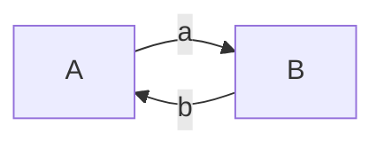
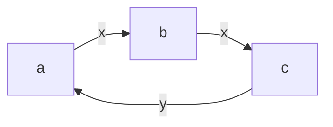

*暂时还没有 AK，留坑*

# A. Space Navigation
## 大致题意
给你一段在棋盘上的移动指令，问能否通过在不改变原指令顺序，仅删除部分或者全部或者不删除的情况下，到达某个指定地点

## 分析
可以通过指令直接得出可以到达的范围，比如删除所有的“向左”指令后，能够到达的最右，同理可以得到四个方向的极值，最后判断目标地点是否在极值范围内即可

## AC code

```cpp
#include <bits/stdc++.h>

using namespace std;

int main() {
    int _;
    cin >> _;
    for (int ts = 0; ts < _; ++ts) {
        int x, y;
        string str;
        cin >> x >> y >> str;
        int cnt[4] = {0, 0, 0, 0};
        for (auto &item : str) {
            switch (item) {
                case 'R':
                    cnt[0]++;
                    break;
                case 'L':
                    cnt[1]++;
                    break;
                case 'U':
                    cnt[2]++;
                    break;
                case 'D':
                    cnt[3]++;
                    break;
            }
        }
        if (-cnt[1] <= x && x <= cnt[0] && -cnt[3] <= y && y <= cnt[2]) cout << "YES" << endl;
        else cout << "NO" << endl;
    }
}
```

# B. New Colony
## 大致题意
给你一段台阶，然后你从第一阶开始往下面滚砖块，砖块遇到下坡就走到下一阶，遇到上坡就停止，并增加这一阶的高度。给你 $n$ 个砖块，请问最后一块砖块停止在哪里

## 分析
首先这道题如果不能使用暴力的话，是很麻烦的一道题。但是注意观察这道题的数据范围


$$1 \leq n \leq 100, 1 \leq k \leq 10^9, 1 \leq h_i \leq 100, \sum n \leq 100$$


假如阶梯是一直下坡或者平坡，那么砖块就会直接掉出阶梯。而如果砖块没有掉出阶梯，那么它一定会不会处于整个阶梯的最高处。所以考虑一个可能，即不断的滚落的方块将整个阶梯都填满成平地，则最多需要 $n \times h_i = 10000$ 个砖块

也就是说，当 $k > 10000$ 时，则最后一块砖块必然掉出阶梯。那么当 $k \leq 10000$ 时，暴力求解即可

## AC code
```cpp
#include <bits/stdc++.h>

using namespace std;

#define int long long

int main() {
    int _;
    cin >> _;
    for (int ts = 0; ts < _; ++ts) {
        int n, k;
        cin >> n >> k;
        vector<int> data(n);
        for (int i = 0; i < n; ++i) cin >> data[i];
        if (k > 10000) cout << -1 << endl;
        else {
            int last = -1;
            for (int i = 0; i < k; ++i) {
                int cur = 0;
                while (cur < n - 1 && data[cur + 1] <= data[cur]) cur++;
                if (cur == n - 1) last = -1;
                else {
                    data[cur]++;
                    last = cur + 1;
                }
            }
            cout << last << endl;
        }
    }
}
```

# C. Fence Painting
## 大致题意
一个篱笆有 $n$ 个木条组成，每个木条有一个初始的颜色。每一个木条都有一个指定的目标颜色。有 $m$ 个油漆工，每个油漆工都只携带一种颜料，按照顺序来给这个篱笆上色，他们每次必须选择一块且恰好一块木板，把它的颜色变成油漆工所携带的颜色。问每个油漆工应该选择哪一块，使得最后的木条都变成指定的颜色

## 分析
首先，肯定找出目前没有达到目标的木条，然后找到合适的油漆工给它上色。如果找不到合适的油漆工，那么肯定没戏

接下来是剩下的多出来的没有使用的油漆工，也需要为他们找一块木板去上色。

注意到，由于后来的可以覆盖前面的颜色，所以可以直接考虑最后那个油漆匠。

如果根据上面的操作，这个油漆匠已经有了一块木板去上色的话，那么剩下多出来的油漆工可以都给这块木板上色，这样的话，无论最后上色是什么，最后一个油漆匠一定能把这块木板染回指定的颜色。

而如果最后一个油漆工也在那些没有使用的油漆工内，那么他只需要找到一块最终颜色和自己所携带的颜色相同的，然后指定他去给这块木板上色。剩下的那些没有使用的油漆工也去给这块木板上色即可。


## AC code
```cpp
#include <bits/stdc++.h>

using namespace std;

void solve() {
    int _;
    cin >> _;
    for (int ts = 0; ts < _; ++ts) {
        int n, m;
        cin >> n >> m;
        vector<int> a(n), b(n), c(m), res(m, 0);
        map<int, vector<int>> data;
        for (int i = 0; i < n; ++i) cin >> a[i];
        for (int i = 0; i < n; ++i) {
            cin >> b[i];
            if (a[i] != b[i]) data[b[i]].push_back(i + 1);
        }
        for (int i = 0; i < m; ++i) cin >> c[i];
        for (int i = 0; i < m; ++i) {
            auto iter = data.find(c[i]);
            if (iter == data.end()) continue;
            res[i] = iter->second.back();
            iter->second.pop_back();
            if (iter->second.size() == 0) data.erase(iter);
        }
        if (res.back() == 0) for (int i = 0; i < n; ++i) if (c.back() == b[i]) res.back() = i + 1;
        for (auto &item : res) if (item == 0) item = res.back();
        if (res.back() == 0 || !data.empty()) cout << "NO" << endl;
        else {
            cout << "YES" << endl;
            for (int i = 0; i < res.size(); ++i) cout << res[i] << " \n"[i == res.size() - 1];
        }
    }
}
```

# D. AB Graph
## 大致题意
给你一个完全有向图，每条边都有一个字母标记，标记的字母只有可能是 “a” 或者 “b”。你需要找出一条可以包含重复点重复边的路径，满足这条路径的长度等于给定的要求，并且这条路径组成的字符串为回文串

## 分析
首先，由于可以有重复点和重复边，那么考虑下面的情况

### 如果这个图只有两个点。
此时只有两条边。如果这两条边恰好字母还相同(例如下面的 mermaid 图)，那么任意长度的路径都可以画出来，只需要在这两个点之间来回走即可


如果这两条边的字母还不相同(例如下面的 mermaid 图)，那么来回的路径为奇数的时候，可以画出来，只需要在这两个点之间来回走即可



### 如果这个图至少有三个点
取出整个图中任意三个点，假定这三个点为 $a, b, c$，这里定义 $g(a, b)$ 为从点 $a$ 到点 $b$ 的路径的标记字母。那么我们可以知道，一定满足 $g(a, b) = g(b, c)$ 或 $g(b, c) = g(c, a)$ 或 $g(c, a) = g(a, b)$ 其中至少一个

> 证明
> 反证法，假设上述不成立，则
> 由上述得 $g(a, b) \not = g(b, c)$，那么 $g(a, b)$ 与 $g(b, c)$ 相异。
> 由上述得 $g(b, c) \not = g(c, a)$，那么 $g(b, c)$ 与 $g(c, a)$ 相异。由于 $g(a, b)$ 与 $g(b, c)$ 相异，而所有边只有两种可能，所以 $g(c, a)$ 与 $g(b, c)$ 必定相同
> 由上述得 $g(c, a) \not = g(a, b)$，那么 $g(c, a)$ 与 $g(a, b)$ 相异，这与上面的结论相反，所以假设不成立，即，上述结论成立

这时，通过交换 $a, b, c$ 三个点，使得 $g(a, b) = g(b, c)$ 得到满足，则可以得到下图



这里，我们不需要关心 $y$ 的情况，无论它是否与 $x$ 相同

这里，只需要进行 $a \rightarrow b \rightarrow c \rightarrow a$ 这样的循环，即可实现一个回文串。只需要确定是从哪一个节点开始循环即可

 - 若从 $a$ 开始循环，则得到的串为 $xxyxxyxxyxx \dots$ 当长度为 $3t + 2$　时为回文串
 - 若从 $b$ 开始循环，则得到的串为 $xyxxyxxyxxyx \dots$ 当长度为 $3t$ 时为回文串
 - 若从 $c$ 开始循环，则得到的串为 $yxxyxxyxxyxxy \dots$ 当长度为 $3t + 1$ 时为回文串

所以只需要判断所需要的字符串长度与 $3$ 取模即可

## AC code

```cpp
#include <bits/stdc++.h>

using namespace std;

int main() {
    int _;
    cin >> _;
    for (int ts = 0; ts < _; ++ts) {
        int n, m;
        cin >> n >> m;
        vector<string> g(n);
        for (auto &item : g) item.reserve(n);
        for (int i = 0; i < n; ++i) cin >> g[i];

        if (n == 2) {
            if (g[0][1] == g[1][0] || m % 2 == 1) {
                cout << "YES" << endl;
                for (int i = 0; i < m + 1; ++i) cout << (i % 2) + 1 << " \n"[i == m];
            } else {
                cout << "NO" << endl;
            }
        } else {
            vector<int> tmp(3);
            for (int i = 0; i < 3; ++i) tmp[i] = i;
            do {
                if (g[tmp[0]][tmp[1]] == g[tmp[1]][tmp[2]]) break;
            } while (next_permutation(tmp.begin(), tmp.end()));

            assert(g[tmp[0]][tmp[1]] == g[tmp[1]][tmp[2]]);
            int cur = (m + 1) % 3;

            cout << "YES" << endl;
            for (int i = 0; i < m + 1; ++i) cout << tmp[(i + cur) % 3] + 1 << " \n"[i == m];
        }
    }
}
```

# E. Sorting Books
## 大致题意
给你一段数列，进行如下的操作使得整个序列中相同的数字处于连续的子段中

操作：将这个数字放到整个字符串的最后

问，最少需要进行多少次操作

## 分析
首先，如果进行 $n$ 次操作，那么必然可以使得整个序列满足上述的要求。因为只需要按照排序后的顺序来移动所有的数字，则必定可以满足条件

那么接下来就是想办法减少次数。

如果我选出一个值，当数字与这个值相同的时候，不对其进行操作。由于其他值被移动到了最后。所以与这个值相同的值都自然而然的被移动到了最前面，例如下面这个序列


$$1, 3, 2, 2, 1, 3$$


如果我选择 $3$ 作为固定值，那么当 $1, 2$ 都进行过移动后，$3$ 自然而然的也就满足了条件

再进一步，如果稍微修改一下这个序列，将其改为


$$1, 3, 1, 2, 3, 2$$


这时，发现当我仅对 $3$ 进行移动之后，$1, 2$ 自然而然的也满足条件了。由此，可以得到一个这样的推广结论：

在某一个子区间内，如果这个子区间内存在某一个数值 $x$，满足整个区间的所有 $x$ 都在这个子区间内，那么，这个 $x$ 可以固定不动，且这个子区间内的其他所有值都需要进行操作。

所以此时可以进行 dp 求解，方法如下：

 - 找出所有值所对应的最小子区间
 - 假如这个子区间内选择这个值作为固定值，那么它所带来的代价就是这个子区间的长度减去这个值的个数
 - 由于需要进行减法比较麻烦，可以改变思路用加法，即求出有多少个值是可以固定不操作的
 - 则对于每一个区间的固定值，那么其带来的固定值数量就是这个区间内的值的个数
 - 对每一位进行 dp 求解即可

## AC code
```cpp
#include <bits/stdc++.h>

using namespace std;

int main() {
    int n;
    cin >> n;
    vector<int> data(n), l(n + 1, n), r(n + 1), dp(n + 1), cnt(n + 1);
    for (int i = 0; i < n; ++i) {
        cin >> data[i];
        l[data[i]] = min(l[data[i]], i);
        r[data[i]] = max(r[data[i]], i);
    }
    for (int i = n - 1; i >= 0; --i) {
        cnt[data[i]]++;
        dp[i] = max(dp[i + 1], cnt[data[i]]);
        if (l[data[i]] == i) dp[i] = max(dp[i], cnt[data[i]] + dp[r[data[i]] + 1]);
    }
    cout << n - dp[0] << endl;
}
```
