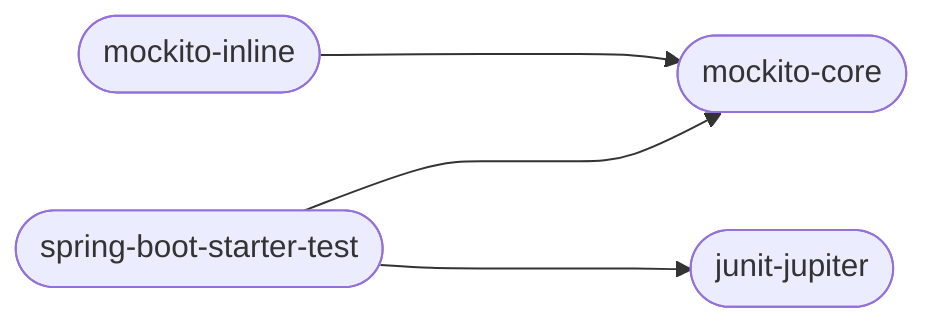

# 什么是单元测试

单元测试就是一部分代码，但是它

 - 不会在正常的业务流程中被执行
 - 不被打包进入最终的编译程序
 - 不会被任何其他业务代码以任何方式导入
 - 不会影响正常的代码

当然，它通常还要满足下面这些条件

 - 自动化的，不需要人工输入任何数据即可完成
 - 独立的，任何两个单元测试之间都不应该发生调用关系
 - 可重复的，单元测试可以无限重复执行且结果应该一致

传统的单元测试，即是测试一个函数是否正确运行。单元测试可以**为这个函数预先伪造一个测试环境**，例如用户登录了，且已经有超管权限了，那么运行这个函数是否能够得到我们期望得到的结果

注意上面这段文字中的提到的「为这个函数预先伪造一个测试环境」，这似乎不是很难理解，让我来举个例子：

> - 例如我们现在希望测试登录能力，这是多数的服务中通常都有的能力，按照一般的编码规范，我们将会在 service 层进行逻辑判断。例如取出匹配此账号的数据库的值，并校验密码。
> - 这是非常传统的做法，也同样足够的有效。接下来，让我们来为这个测试伪造一个环境
> > - 首先，我们在数据库中插入一个数据，当然，此时我们并不需要考虑到底插入了什么，因为我现在想要模拟假如没有此账号的似乎，登录的结果
> > - 然后，我们请求对应的接口，使用新的随机数据，当然，这时候我们期望得到的是失败的登录请求，因为我们输入的数据就是不存在的。
>
> - 让我们来重新回顾整个过程，这个过程我们做了什么？我们访问了数据库！还修改了里面的数据！这太可怕了！
> - 假如这件事放在业务上，我们需要在发布环境通过单元测试来校验代码是否合理的时候，我们还需要插入一条数据！这仅仅只是一个登录失败的测试，这太可怕了！
> - 那有没有什么可能的方案来解决这个问题？
> - 接下来就轮到 Mock 来伪造这个过程了
> - 还是以登录失败为例，我们现在假定 service 是直接调用了 dao 层接口
> > - 首先，我们 mock 了用户的 dao 层接口，并指定「获取用户」的接口若传入 "ABC" 这个字符串，则返回不存在这个用户
> > - 然后我们调用用户的登录接口，并传入 "ABC" 作为账号
> > - 当用户的 service 遇到需要调用用户的 dao 接口时，会被上面设定的规则将会导致不再请求数据库，而是直接返回不存在
> > - service 收到不存在后，包装好返回值，并返回
> - 虽然看起来与刚才的，最终的结果是一样的，我们测试的代码几乎是相同的，但是我们却解决了最重要的问题——访问数据库

事实上，很多时候 mock 并不是解决这个问题的。我们希望单元测试能够单独测试一个函数是否逻辑正确，那么我们仅需要测试这个函数即可，当这个函数需要调用其他函数的时候，我们会对函数进行 mock 使得得到我们期望的值。这样就可以实现仅仅校验此函数的逻辑是否正确了

# 单元测试的意义

 - 在不需要启动服务的情况下，检查代码逻辑是否有问题
 - 保证代码在后续的迭代过程中，被其他人更新后导致原来可以正常运行的结果变得不正确了

因为单元测试是负责完成代码测试的，所以当完整的单元测试写完之后，我们就可以通过单元测试来校验代码逻辑是否有问题

同时单元测试将会一直存在与源代码中，后续每一次需要进行校验发布时，都可以通过运行一次单元测试来检查是否因为本次修改，导致之前的逻辑出现错误

# 单元测试的标准

 - 单元测试应该是全自动执行的，并且非交互式的。测试用例通常是被定期执行的，执行过程必须完全自动化才有意义。输出结果需要人工检查的测试不是一个好的单元测试。单元 测试中不准使用 System.out 来进行人肉验证，必须使用 assert 来验证。
 - 保持单元测试的独立性。为了保证单元测试稳定可靠且便于维护，单元测试用例之间决不能互相调用，也不能依赖执行的先后次序。
 - 单元测试是可以重复执行的，不能受到外界环境的影响。
 - 对于单元测试，要保证测试粒度足够小，有助于精确定位问题。单测粒度至多是类级别，一般是方法级别。
 - 单元测试代码必须写在如下工程目录:src/test/java，不允许写在业务代码目录下。
 - 单元测试应当包含「边界值测试」、「正确的输入」、「强制错误信息输入」的测试，而不是仅仅以满足覆盖率为标准

# 你需要会哪些代码知识

本博客的知识范围是 SpringBoot 框架，所以你必须要掌握下面的技能

 - 能够熟练使用 Java 语言编写代码
 - 了解 SpringBoot 的 AOP 的设计思想，会使用依赖注入
 - 能够看懂上面的基本概念，了解单元测试的重要性
 - 会使用 maven，并知道如何使用 maven
 - 能够阅读中文，并能看懂本博客

# 开始写单元测试

单元测试的代码应该位于你的项目目录 `src/test/java` 下，接下来所有的内容目录都指此目录

## 导入 maven 依赖

我们需要了解下面几个重要的依赖，但是并非

```xml
<!-- Junit 5 -->
<dependency>
    <groupId>org.junit.jupiter</groupId>
    <artifactId>junit-jupiter</artifactId>
</dependency>
<!-- Mockito 核心 -->
<dependency>
    <groupId>org.mockito</groupId>
    <artifactId>mockito-core</artifactId>
</dependency>
<!-- Mockito 对 static 支持 -->
<dependency>
    <groupId>org.mockito</groupId>
    <artifactId>mockito-inline</artifactId>
</dependency>
<!-- Spring 对单元测试支持 -->
<dependency>
    <groupId>org.springframework.boot</groupId>
    <artifactId>spring-boot-starter-test</artifactId>
</dependency>
```

以上这些依赖的相互依赖关系



所以，实际上你只需要最后两个依赖即可完成本片博客的所有内容，但是还是有必要详细解释一下这些依赖在本博客中起到的作用

 - junit5：必须的组件，提供了最重要的注解和单元测试能力
 - mockito-core：必须的组件，提供了最重要的 Mock 的能力
 - mockito-inline：非必须组件，提供了对静态方法的 Mock 能力，如果不需要对静态方法进行 Mock 则可以不需要
 - spring-boot-starter-test：非必须组件，提供了对类的 private 变量的赋值能力，实际上反射也可以做到，但是通常为了方便期间，可以直接使用已经有的轮子

# 应对各种情况

## 指定调用的目标函数的返回值

## 让调用的目标函数抛出错误

## 让调用的目标函数做一些指定的事情

## 如何应对没有返回值的函数

## 如何控制那些静态的函数

## 如何测试 private 的方法

