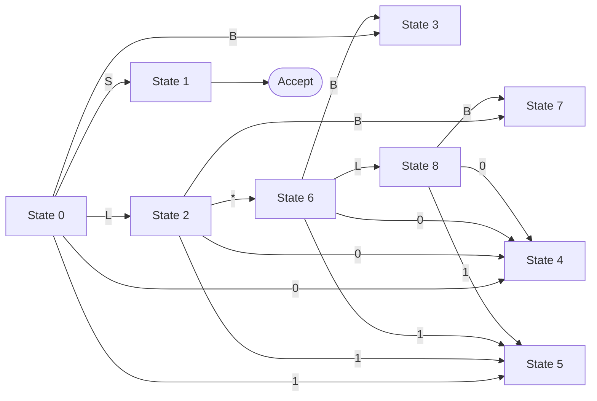
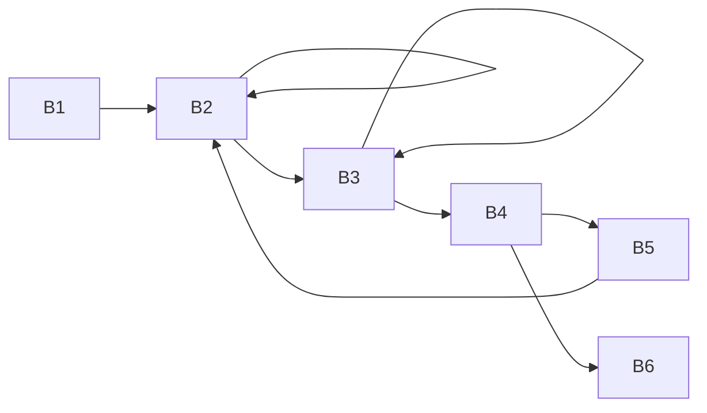
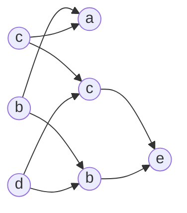
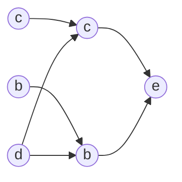

# 引言
 - 编译：将高级语言翻译成汇编语言或机器语言的过程

## 编译过程的五个阶段
 1. 词法分析
 2. 语法分析
 3. 词义分析与中间代码生成
 4. 优化
 5. 目标代码生成

## 编译过程的八个部分
 1. 词法分析程序
 2. 语法分析程序
 3. 语义分析程序
 4. 中间代码生成
 5. 代码优化程序
 6. 目标代码生成程序
 7. 错误检查和处理程序
 8. 信息表管理程序

# 文法和语言
## 基本概念
### 字母表
字母表 $\sum$ 是一个<font color=red>有穷的符号集合</font>，符号包括了字母、数字、标点符号……

### 字母表上的运算
 - 乘积：$$\sum_1 \sum_2 = \{ab | a \in \sum_1 , b \in \sum_2 \}$$。即从 $\sum_1$ 中选择一个字符串，和 $\sum_2$ 中的一个字符串连接
 - 幂：即多次进行自我乘积的过程。字母表的 $n$ 次幂指长度为 $n$ 的符号串构成的集合
 - 正闭包：长度正数的符号串构成的集合（任意一个合理的符号串均属于字母表的正闭包）记作：$\sum^+$
 - 克林闭包：允许长度为 $0$ 的正闭包，记作：$\sum^*$

### 串
 - 串是字母表的克林闭包的一个元素，是字母表中符号的一个有穷序列
 - 串的长度通常记作 $|s|$，指的是串 $s$ 中的符号个数
 - 空串是长度为 $0$ 的串，用 $\varepsilon$ 表示，$|\varepsilon | = 0$

### 串上的运算
 - 连接
 - 幂

## 文法的定义
对于文法 $G$，可以定义为 $G = (V_T, V_N, P, S)$
 - $V_T$：终结符集合，表示的是一系列不可以被符号替换的符号，例如“宾语”不是一个终结符，而“水果”则是一个终结符。非空有穷集
 - $V_N$：非终结符集合，表示的是一系列一定可以被符号替换的符号，在等式中至少会出现一次在等号左侧的符号。非空有穷集
 - $P$：产生式/规则，表示的是替换过程，可以表示为 $\alpha \rightarrow \beta$，其中 $\alpha \in (V_N \cup V_T)^\*$且至少包含一个非终结符。$\beta \in (V_N \cup V_T)^\*$。非空有穷集
 - $S$：开始符号，表示的是该文法中最大的语法成分，例如 $S = 句子$

### 产生式的简写
对于含有相同左部的产生式，可以通过“或”运算简写
例如对于

$$\alpha \rightarrow \beta_1 , \alpha \rightarrow \beta_2 , \dots , \alpha \rightarrow \beta_n$$

可以简写为

$$\alpha \rightarrow \beta_1 | \beta_2 | \dots | \beta_n$$

### 符号约定
 - 下列符号是终结符
     * 字母表中排在前面的小写字母，如 a、b、c
     * 运算符，如+、*等
     * 标点符号，如括号、逗号
     * 数字，0、1、……、9
     * 粗体字符串，如**id**、**if**
 - 下列符号是非终结符
     * 字母表中排在前面的大写字母，如 A、B、C
     * 字母 S，通常表示开始符号
     * 小写、斜体的名字，如*expr*、*stmt*
     * 代表程序构造的大写字母，如 $E$(表达式)、$T$(项)、$F$(因子)
 - 字母表中排在后面的大写字母表示文法符号(终结符或非终结符)，如 $X、Y、Z$
 - 字母表中排在后面的小写字母表示终结符号串，如 $u、v、\dots 、z$
 - 小写希腊字母表示文法符号串 $\alpha 、\beta 、 \gamma$
 - 除非特别说明，第一个产生式的左部就是开始符号

## 语言的定义
### 推导
从语言的规则<font color=red>推导</font>生成语言的过程

根据规则，可以将符号串推成另一个符号串的过程称为推导。用产生式的右部替换产生式的左部

如果是经过多次推导得到，则记为 $a_0 \Rightarrow^n a_n$

$a_0 \Rightarrow^+ a_n$ 表示经过至少一步推导得到
$a_0 \Rightarrow^* a_n$ 表示经过任意步数推导得到

### 规约
根据语言的规则<font color=red>识别</font>语言的过程

根据规则，可以将符号串还原成。将产生式的右部替换为产生式的左部

### 句型和句子
 - 如果 $S \Rightarrow^\* \alpha, \alpha \in (V_T \cup V_N)^\*$ 则称 $\alpha$ 是语法 $G$ 的一个句型
 - 一个句型中既可以包含终结符，也可以包含非终结符，也可以是空串
 - 如果 $S \Rightarrow^\* w, w \in V_T^\*$ 则称 $w$ 是 $G$ 的一个句子
 - 句子是不包含任何非终结符的句型
 - 由文法推导出的所有句子构成的集合称为：文法 $G$ 生成的语言，记为 $L(G)$，即

$$L(G) = \{w | S \Rightarrow^* w, w \in V_T^* \}$$

## 文法的分类
### 0型文法
对于 $\forall \alpha \rightarrow \beta \in P$，满足 $\alpha$ 中至少包含一个非终结符

### 1型文法(上下文有关文法)
对于 $\forall \alpha \rightarrow \beta \in P$，满足 $|\alpha| \leq |\beta|$

也可以理解为对于 $\forall \alpha A \beta \rightarrow \alpha \gamma \beta \in P$，其中 $\alpha$、$\beta$ 可以为 $\varepsilon$，满足 $\gamma \neq \varepsilon$(在 $A = S$ 的情况下，此等式可以成立)

### 2型文法(上下文无关文法)
对于 $\forall \alpha \rightarrow \beta \in P$，满足 $\alpha$ 是一个非终结符

### 3型文法(正规文法)
对于 $\forall \alpha \rightarrow \beta \in P$，满足 $\alpha$ 是一个非终结符，而 $\beta$ 只能是空串、一个终结符号或者一个终结符号和一个非终结符号

## CFG 分析树
分析树是推导的图形化表示


### 二义性文法
如果一个文法可以为某个句子生成多棵分析树，则称这个文法是二义性的

# 词法分析
## 正则表达式
正则表达式(简称：RE)是一种描述正则语言的表示方法，正则表达式可以由较小的正则表达式按照特定规则递归地构建。每个正则表达式 $r$ 定义(表示)一个语言，记为 $L(r)$。这个语言也是根据 $r$ 的子表达式所表示的语言递归定义的


### 正则表达式的定义
 - $\varepsilon$ 是一个 RE，$$L(\varepsilon) = \{ \varepsilon \}$$
 - 如果 $a \in \sum(字母表)$，则 $a$ 是一个 RE，$$L(a) = \{a\}$$
 - 加入 $r$ 和 $s$ 都是 RE，表示的语言分别是 $L(r)$ 和 $L(s)$，则
     * $r|s$ 是一个 RE，$L(r|s) = L(r) \cup L(s)$
     * $rs$ 是一个 RE，$L(rs) = L(r)L(s)$
     * $r^\*$ 是一个 RE，$L(r^\*) = (L(r))^\*$
     * $(r)$ 是一个 RE，$L((r)) = L(r)$

 - 可以用RE定义的语言叫做正则语言(regular language)或正则集合(regular set)
 - 对任何正则文法 $G$，存在定义同一语言的正则表达式 $r$
 - 对任何正则表达式 $r$，存在生成同一语言的正则文法 $G$


### 正则定义
给一些RE命名，并在之后的RE中像使用字母表中的符号一样使用这些名字

## 有穷自动机
具有一系列离散的输入输出信息和有穷数目的内部状态的系统

### 有穷自动机的分类
 - 确定的有穷自动机
 - 不确定的有穷自动机

### 确定的有穷自动机(DFA)
对于任意的一个输入，自动机都唯一地确定了下一个状态

定义 $M=(S, \sum, \delta, s_0, F)$ 为一个确定的有穷自动机

 - $S$：有穷状态集
 - $\sum$：输入的字母表，即输入的符号集合($\varepsilon \notin \sum $)
 - $\delta$：$\forall s \in S, a \in \sum, \delta(s, a)$ 表示从状态 $s$ 出发，沿着标记为 $a$ 的边所能到达的状态
 - $s_0$：开始状态，$s_0 \in S$
 - $F$：接收状态(终止状态)的集合，$F \subseteq S$

确定的有穷自动机可以通过状态图来表示


初始结点通常用 $\Rightarrow$ 表示，终态结点通常为双圈表示

确定的有穷自动机还可以使用表格来表示其状态，例如上述的状态图可以表示为

| 状态 | 0 | 1 |
|:-:|:-:|:-:|
| $S_0$ | $S_1$ | $S_0$ |0
| $S_1$ | $S_1$ | $S_2$ |0
| $S_2$ | $S_1$ | $S_0$ |1

通常，在表格对应行的右端通过01的标注表示这个状态为终态

对于 $\sum^*$ 中的任意符号串 $t$，如果在状态图中存在一条从初态到某一终态的路径，且这条路径上所有弧的标记符连接起来等于 $t$，则称 $t$ 可以被此 DFA 接受

### 不确定的有穷自动机(NFA)
收到一个符号，可能进入不同的状态

定义 $M=(S, \sum, \delta, s_0, F)$ 为一个确定的有穷自动机

 - $S$：是一个有穷集，它的每一个元素称为一个状态
 - $\sum$：是一个有穷字母表，它的每一个元素称为一个输入符号
 - $\delta$：表示一个转移函数，可以描述为$$S \times (\sum \cup \{\varepsilon \}) \rightarrow P(S)$$。$P(S)$ 是 $S$ 的一个子集
 - $s_0$：$S_0 \in S$，表示自动机的初始态
 - $F$：接收状态(终止状态)的集合，$F \subseteq S$

NFA 也可以通过状态图来表示和表格进行表示，与 DFA 的状态图类似

### DFA 和 NFA 的等价性
 - 对任何非确定的有穷自动机 N ，存在定义同一语言的确定的有穷自动机 D
 - 对任何确定的有穷自动机 D ，存在定义同一语言的非确定的有穷自动机 N

### 从正则表达式转为 NFA
参考下面两张图


### NFA 转 DFA
步骤：
 1. 从起始状态开始，通过所有的路径，得到新的状态集的组合
 2. 将所有新的状态集组合重新通过路径，重复操作直到没有新的组合
 3. 将状态集作为 DFA 的结点，建成 DFA 状态机
 4. 如果新的状态包含原来的可接受状态(终止状态)，则认为新的状态也是可接受状态

> 以下图为例

> 画出如下的表格

| 序号 | 状态 | a | b |
|:-:|:-:|:-:|:-:|
| 1 | 0 | 0,1 | 1 |
| 2 | 0,1 | 0,1 | 1 |
| 3 | 1 | 0 |  |

> 将序号代替状态，重新绘图
> 

### DFA 最小化
 - 删除从起始结点开始的不可到达的状态
 - 合并所有的等价状态
     * 两个状态必须同时是可接受状态或不可接受状态
     * 对于所有输入的符号，两个状态都必须转换到等价的状态里

> 以上方的图为例，易得状态 1 和状态 2 是等价状态，所以合并得到

| 序号 | 状态 | a | b |
|:-:|:-:|:-:|:-:|
| 1 | 0 | 1 | 2 |
| 2 | 1 | 1 | |

> 最终得到
> 

# 自顶向下语法分析方法
## 自顶向下的分析思想
从分析树的顶部（根节点）向底部（叶节点）方向构造分析树，可以看成是从文法开始符号S推导出词串w的过程

### 最左推导
在最左推导中，总是选择每个句型的最左非终结符进行替换，即优先满足表达式左侧


### 最右推导
在最右推导中，总是选择每个句型的最右非终结符进行替换，即优先满足表达式右侧


自顶向下的语法分析采用最左推导方式

### 预测分析
 - 预测分析是递归下降分析技术的一个特例，通过在输入中向前看固定个数（通常是一个）符号来选择正确的A-产生式。
 - 可以对某些文法构造出向前看k个输入符号的预测分析器，该类文法有时也称为LL(k) 文法类
 - 预测分析不需要回溯，是一种确定的自顶向下分析方法

## 文法转换
### 消除左递归
#### 直接左递归
当出现了类似如下的推导公式时

$$A \rightarrow A \alpha | \beta$$

时，此时可以出现左递归的情况，这会导致无法正确的进行最左推导，因为可以出现下面的情况：

$$A \Rightarrow A \alpha \Rightarrow A \alpha\alpha \Rightarrow A \alpha\alpha\alpha \Rightarrow A \alpha\alpha\alpha\alpha \dots$$

此时可以将上述的推导公式转换为

$$
\begin{cases}
A \rightarrow \beta A' \\
A' \rightarrow \alpha A' | \varepsilon
\end{cases}
$$

将左递归的公式转换为右递归即可

这样的操作的代价是
 - 引入了非终结符
 - $\varepsilon$ 产生式

#### 间接左递归
例如

$$
\begin{cases}
S \rightarrow Aa | b \\
A \rightarrow Sd | \varepsilon
\end{cases}
$$

此时可以产生这样的推导

$$S \rightarrow Aa \rightarrow Sda \rightarrow Aada \rightarrow Sdada \dots$$

这时，应该将改为先进行替换得到

$$A \rightarrow Aad | bd | \varepsilon$$

$$
\begin{cases}
A \rightarrow bdA' | A' \\
A' \rightarrow abA' | \varepsilon
\end{cases}
$$

### 多个候选式
当出现

$$S \rightarrow aAd | aBe$$

之类的结构，当读入的第一个字符为 $a$ 时，无法确定应该选择哪个产生式的时候，应该进行左公因子提取，即改编为

$$
\begin{cases}
S \rightarrow aS' \\
S' \rightarrow Ad|Be
\end{cases}
$$

## LL(1) 文法
### FIRST 集
$FIRST(A)$ 集表示非终结符 $A$ 能够推导出的所有等式的第一个终结符的集合

$$FIRST(\alpha) = \{ a | \alpha \Rightarrow a \beta, a \in V_T ， \alpha, \beta \in V^* \}$$

这条等式可以用下面三个原则来求算

对于一个产生式 $A \rightarrow B$而言
 - 若 $B$ 的第一个符号是终结符，则将此终结符加入到 $FIRST(A)$ 中
 - 若 $B$ 的第一个符号是非终结符，则将此非终结符的 $FIRST$ 中除了 $\varepsilon$ 的加入到 $FIRST(A)$ 中
 - 若 $B$ 的第一个符号是非终结符，它的 $FIRST$ 集中含有 $\varepsilon$ 则将下一个符号也进行这三条规则的判断，如果没有，下一个字符了，则将 $\varepsilon$ 加入到 $FIRST(A)$ 中

### FOLLOW 集
$FOLLOW(A)$ 集表示非终结符 $A$ 后可以跟随哪些终结符

$$FOLLOW(A) = \{ a | S \Rightarrow^* \dots A a \dots，a \in V_T \}$$
$$若 A \Rightarrow^* \dots A，则 \# \in FOLLOW(A)$$

这两条等式可以用下面三个原则来求算
 - 对于文法开始符号 $S$，则 $$ \# \in FOLLOW(S)$$
 - 若存在类似 $B \rightarrow \alpha A \beta$ 的表达式，则 $$FIRST(\beta) - \{\varepsilon\} \subseteq FOLLOW(A)$$
 - 若存在类似 $B \rightarrow \alpha A$ 或者 $B \rightarrow \alpha A \beta 且 \beta \Rightarrow^* \varepsilon$，则 $$FOLLOW(B) \subseteq FOLLOW(A)$$

### SELECT 集
表示使用某个产生式的选择符号

$$
\begin{cases}
SELECT(A \rightarrow \alpha) = (FIRST(\alpha) - \{\varepsilon\}) \cup FOLLOW(A)，\alpha \Rightarrow^* \varepsilon \\
SELECT(A \rightarrow \alpha) = FIRST(\alpha)，\alpha \not\Rightarrow^* \varepsilon
\end{cases}
$$

同时满足

$$SELECT(A \rightarrow \alpha) \cap SELECT(A \rightarrow \beta) = \varnothing$$

### LL(1)
#### 方法一
满足 LL(1) 的文法有下面三个条件：

若文法存在语句

$$A \rightarrow \alpha | \beta$$

则
 - 不存在终结 $a$ 使得 $\alpha$ 和 $\beta$ 都能推导出以 $a$ 开头的串，即 $FIRST(\alpha) \cap FIRST(\beta) = \varnothing$
 - $\alpha$ 和 $\beta$ 至多有一个能推导出 $\varepsilon$
 - 满足下面的等式

$$
\begin{cases}
FIRST(\alpha) \cap FOLLOW(A) = \varnothing, \beta \Rightarrow^* \varepsilon \\
FIRST(\beta) \cap FOLLOW(A) = \varnothing, \alpha \Rightarrow^* \varepsilon
\end{cases}
$$

#### 方法二
$$对于所有的 A \rightarrow \alpha | \beta$$

若满足

$$SELECT(A \rightarrow \alpha) \cap SELECT(A \rightarrow \beta) = \varnothing$$

则为 LL(1)

### 非递归的预测分析法(表驱动的预测分析)

首先需要根据 $SELECT$ 集来构建一个分析表。通过表的信息实现语法分析

### LL(1) 文法分析示例
以下面的表达式文法为例

$$
\begin{cases}
E \rightarrow E + T | T \\
T \rightarrow T * F | F \\
F \rightarrow i | (E)
\end{cases}
$$

#### 消除左递归
首先，消除左递归，易得，前两个式子均为左递归
得到

$$
\begin{cases}
E \rightarrow TE' \\
E' \rightarrow +TE' | \varepsilon \\
T \rightarrow FT' \\
T' \rightarrow *FT' | \varepsilon \\
F \rightarrow i | (E)
\end{cases}
$$

#### 求出 FIRST
得到各个符号的 FIRST 集：

首先根据2、4、5式得到

$$
\begin{cases}
FIRST(E') = \{+, \varepsilon\} \\
FIRST(T') = \{*, \varepsilon\} \\
FIRST(F) = \{i, (\}
\end{cases}
$$

然后根据 FIRST 集的求出剩下的 FIRST 集

$$
\begin{cases}
FIRST(E) = \{i, ( \} \\
FIRST(T) = \{i, ( \}
\end{cases}
$$

#### 求出 FOLLOW 集
然后再求出 FOLLOW 集

首先

$$\# \in FOLLOW(E)$$

然后根据第一个等式得到

$$FIRST(E') - \varepsilon \subseteq FOLLOW(T) \Rightarrow FOLLOW(T) = \{+\}$$
$$FOLLOW(E) \subseteq FOLLOW(E') \Rightarrow FOLLOW(E') = \{\#\}$$

然后继续重复做，直到没有 FOLLOW 集发生更新为止，最终得到

$$
\begin{cases}
FOLLOW(E) = \{ \#, ) \} \\
FOLLOW(E') = \{ \#, ) \} \\
FOLLOW(T) = \{ \#, +, )\} \\
FOLLOW(T') = \{ \#, +, )\} \\
FOLLOW(F) = \{ \#, +, ), *\}
\end{cases}
$$

#### 求出 SELECT 集
再得到 SELECT 集

$$
\begin{cases}
SELECT(E \rightarrow TE') = FIRST(TE') = FIRST(T) = \{i, ( \} \\
SELECT(E' \rightarrow +TE') = FIRST(+TE') = FIRST(+) = \{+\} \\
SELECT(E' \rightarrow \varepsilon) = (FIRST(\varepsilon) - \{\varepsilon \}) \cup FOLLOW(E') = \{ \#, ) \} \\
SELECT(T \rightarrow FT') = FIRST(FT') = FIRST(F) = \{i, (\} \\
SELECT(T' \rightarrow * FT') = FIRST(*FT') = FIRST(*) = \{*\} \\
SELECT(T' \rightarrow \varepsilon) = (FIRST(\varepsilon) - \{\varepsilon \}) \cup FOLLOW(T') = \{ \#, +, )\} \\
SELECT(F \rightarrow i) = FIRST(i) = \{ i \} \\
SELECT(F \rightarrow (E)) = FIRST((E)) = FIRST(() = \{ ( \} \\
\end{cases}
$$

此时，判断是否为 LL(1) 文法
$$
\begin{cases}
SELECT(E' \rightarrow +TE') \cup SELECT(E' \rightarrow \varepsilon) = \varnothing \\
SELECT(T' \rightarrow * FT') \cup SELECT(T' \rightarrow \varepsilon) = \varnothing \\
SELECT(F \rightarrow i) \cup SELECT(F \rightarrow (E)) = \varnothing
\end{cases}
$$

所以是 LL(1)文法

#### 求出分析表
根据 SELECT 得出下表

| | i | + | * | ( | ) | # |
|:-:|:-:|:-:|:-:|:-:|:-:|:-:|
| E | $\rightarrow TE'$ | | | $\rightarrow TE'$ | | |
| E' | | $\rightarrow +TE'$ | | | $\rightarrow \varepsilon$ | $\rightarrow \varepsilon$
| T | $\rightarrow FT'$ | | | $\rightarrow FT'$ | | |
| T' | | $\rightarrow \varepsilon$ | $\rightarrow *FT'$ | | $\rightarrow \varepsilon$ | $\rightarrow \varepsilon$ |
| F | $\rightarrow i$ | | | $\rightarrow (E)$ | | |

#### 分析输入串
采用三列分析法来分析，使用 `#` 表示尾部，假设输入的串为 `i+i*i`

| 栈 | 剩余输入 | 输出 |
|:-:|:-:|:-:|
| `E#` | `i+i*i#` | |
| `TE'#` | `i+i*i#` | 匹配了表中的 $\rightarrow TE'$ |
| `FT'E'#` | `i+i*i#` | $\rightarrow FT'$ |
| `iT'E'#` | `i+i*i#` | $\rightarrow i$ |
| `T'E'#` | `+i*i#` | |
| `E'#` | `+i*i#` | $\rightarrow \varepsilon$ |
| `+TE'#` | `+i*i#` | $\rightarrow +TE'$ |
| `TE'#` | `i*i#` | |
| `FT'E'#` | `i*i#` | $\rightarrow FT'$ |
| `iT'E'#` | `i*i#` | $\rightarrow i$ |
| `T'E' #` | `*i#` | |
| `*FT'E'#` | `*i#` | $\rightarrow *FT'$ |
| `FT'E'#` | `i#` | |
| `iT'E'#` | `i#` | $\rightarrow i$ |
| `T'E'#` | `#` | |
| `E'#` | `#` | $\rightarrow \varepsilon$ |
| `#` | `#` | $\rightarrow \varepsilon$ |

匹配成功


## LL(1) 分析中的出错处理
略

# 自底向上优先分析
## 自底向下的分析思想
从分析树的底部(叶节点)向顶部(根节点)方向构造分析树，可以看成是将输入串w归约为文法开始符号S的过程，自底向上的语法分析采用最左归约方式（反向构造最右推导）

# LR(0) 和 SLR(1) 分析法
 - L: 对输入进行从左到右的扫描
 - R: 反向构造出一个最右推导序列

**<font color=red>由于 SLR(1) 的操作和 LR(0) 分析法相似，且兼容，所以这里直接写 SLR(1) 的操作过程，LR(0) 文法也可以直接用此方法，得到的结果完全相同</font>**

以此文法为例

$$
\begin{cases}
S \rightarrow L*L | L \\
L \rightarrow LB | B \\
B \rightarrow 0 | 1
\end{cases}
$$

## 构造分析表

### 将所有的或运算式子转换为多个式子

得到

$$
\begin{cases}
S \rightarrow L*L \\
S \rightarrow L \\
L \rightarrow LB \\
L \rightarrow B \\
B \rightarrow 0 \\
B \rightarrow 1
\end{cases}
$$

### 合并相同开始符号

LR分析法不适用于有多个开始符号的产生式，所以应当对上面的产生式进行处理得到

$$
\begin{cases}
 0) S' \rightarrow S \\
 1) S \rightarrow L*L \\
 2) S \rightarrow L \\
 3) L \rightarrow LB \\
 4) L \rightarrow B \\
 5) B \rightarrow 0 \\
 6) B \rightarrow 1
\end{cases}
$$

*每行开头的为编号，后续通过编号来指代产生式*

### 建立状态
对于一个状态，首先，判断`.`后面是否为非终结符号。如果是，那我们就得找所有由此非终结符推出的产生式，并将它们添加进入此状态里。循环做即可。

*使用 `.` 表示当前匹配到的位置*

首先建立初状态，将第一个表达式加入初状态 State 0

#### State 0
此状态中有 $S' \rightarrow .S$

检查 `.` 后是否为非终结符，得到 $S$，由于 $S$ 是非终结符，所以将 $S$ 的产生式加入此状态得到

$$
\begin{cases}
S' \rightarrow .S \\
S \rightarrow .L*L \\
S \rightarrow .L \\
\end{cases}
$$

再检查新加入的，得到 $L$ 也需要加入此状态

$$
\begin{cases}
S' \rightarrow .S \\
S \rightarrow .L*L \\
S \rightarrow .L \\
L \rightarrow .LB \\
L \rightarrow .B \\
\end{cases}
$$

最后发现 $B$ 也是需要加入此状态的得到 State 0 的最终结果

$$
\begin{cases}
S' \rightarrow .S \\
S \rightarrow .L*L \\
S \rightarrow .L \\
L \rightarrow .LB \\
L \rightarrow .B \\
B \rightarrow .0 \\
B \rightarrow .1
\end{cases}
$$

接下来的每个状态都是从 State 转换过来的，即将小数点向后移动，可以得到不同的状态
根据其状态内的产生式，可以得到 State 0 可以有 $S, L, B, 0, 1$ 这五个转移方式

#### State 1
设定 State 1 是从 State 0 通过 $S$ 转移过来的

所以可以得到，仅

$$S' \rightarrow S.$$

满足，所以 State 1 即只有此产生式，且不可以再转移

注意，State 1 是第一个产生式的最后的结果，所以此状态作为 `Accept` 状态，简称 `acc`

#### State 2
设定 State 2 是从 State 0 通过 $L$ 转移过来

所以可以直接得到的有

$$
\begin{cases}
S \rightarrow L.*L \\
S \rightarrow L. \\
L \rightarrow L.B \\
\end{cases}
$$

对于第三个式子，其满足条件(`.`后为非终结符)，所以需要把 $B$ 加入此状态

即得到

$$
\begin{cases}
S \rightarrow L.*L \\
S \rightarrow L. \\
L \rightarrow L.B \\
B \rightarrow .0 \\
B \rightarrow .1
\end{cases}
$$

#### 其他 State
不断重复上述步骤，得到下面的图和结果
$$
State 0 =
\begin{cases}
S' \rightarrow .S \\
S \rightarrow .L*L \\
S \rightarrow .L \\
L \rightarrow .LB \\
L \rightarrow .B \\
B \rightarrow .0 \\
B \rightarrow .1
\end{cases}
$$
$$
State 1 =
\begin{cases}
S' \rightarrow S.
\end{cases}
$$
$$
State 2 =
\begin{cases}
S \rightarrow L.*L \\
S \rightarrow L. \\
L \rightarrow L.B \\
B \rightarrow .0 \\
B \rightarrow .1
\end{cases}
$$
$$
State 3 =
\begin{cases}
L \rightarrow B.
\end{cases}
$$
$$
State 4 =
\begin{cases}
B \rightarrow 0.
\end{cases}
$$
$$
State 5 =
\begin{cases}
B \rightarrow 1.
\end{cases}
$$
$$
State 6 =
\begin{cases}
S \rightarrow L*.L \\
L \rightarrow .LB \\
L \rightarrow .B \\
B \rightarrow .0 \\
B \rightarrow .1
\end{cases}
$$
$$
State 7 =
\begin{cases}
L \rightarrow LB.
\end{cases}
$$
$$
State 8 =
\begin{cases}
S \rightarrow L*L. \\
L \rightarrow L.B \\
B \rightarrow .0 \\
B \rightarrow .1
\end{cases}
$$


*Accept通常状态不需要画出*

### 创建LR分析表
由此图和上面的集合可以画出表格
<table border="0" cellpadding="0" cellspacing="0" width="576" style="border-collapse:
 collapse;table-layout:fixed;width:432pt">
    <colgroup>
        <col class="x22" width="72" span="8" style="mso-width-source:userset;width:54pt">
    </colgroup>
    <tbody>
        <tr height="19" style="mso-height-source:userset;height:14.25pt" id="r0">
            <td rowspan="2" height="38" class="x21" width="72" style="height:28.5pt;width:54pt;">状态</td>
            <td colspan="4" class="x21" width="288">ACTION</td>
            <td colspan="3" class="x21" width="216">GOTO</td>
        </tr>
        <tr height="19" style="mso-height-source:userset;height:14.25pt" id="r1">
            <td class="x22">0</td>
            <td class="x22">1</td>
            <td class="x22">*</td>
            <td class="x22">$</td>
            <td class="x22">S</td>
            <td class="x22">L</td>
            <td class="x22">B</td>
        </tr>
        <tr height="19" style="mso-height-source:userset;height:14.25pt" id="r2">
            <td height="19" class="x22" style="height:14.25pt;">0</td>
            <td class="x22">s4</td>
            <td class="x22">s5</td>
            <td class="x22"></td>
            <td class="x22"></td>
            <td class="x22">1</td>
            <td class="x22">2</td>
            <td class="x22">3</td>
        </tr>
        <tr height="19" style="mso-height-source:userset;height:14.25pt" id="r3">
            <td height="19" class="x22" style="height:14.25pt;">1</td>
            <td class="x22"></td>
            <td class="x22"></td>
            <td class="x22"></td>
            <td class="x22">acc</td>
            <td class="x22"></td>
            <td class="x22"></td>
            <td class="x22"></td>
        </tr>
        <tr height="19" style="mso-height-source:userset;height:14.25pt" id="r4">
            <td height="19" class="x22" style="height:14.25pt;">2</td>
            <td class="x22">s4</td>
            <td class="x22">s5</td>
            <td class="x22">s6</td>
            <td class="x22">r2</td>
            <td class="x22"></td>
            <td class="x22"></td>
            <td class="x22">7</td>
        </tr>
        <tr height="19" style="mso-height-source:userset;height:14.25pt" id="r5">
            <td height="19" class="x22" style="height:14.25pt;">3</td>
            <td class="x22">r4</td>
            <td class="x22">r4</td>
            <td class="x22">r4</td>
            <td class="x22">r4</td>
            <td class="x22"></td>
            <td class="x22"></td>
            <td class="x22"></td>
        </tr>
        <tr height="19" style="mso-height-source:userset;height:14.25pt" id="r6">
            <td height="19" class="x22" style="height:14.25pt;">4</td>
            <td class="x22">r5</td>
            <td class="x22">r5</td>
            <td class="x22">r5</td>
            <td class="x22">r5</td>
            <td class="x22"></td>
            <td class="x22"></td>
            <td class="x22"></td>
        </tr>
        <tr height="19" style="mso-height-source:userset;height:14.25pt" id="r7">
            <td height="19" class="x22" style="height:14.25pt;">5</td>
            <td class="x22">r6</td>
            <td class="x22">r6</td>
            <td class="x22">r6</td>
            <td class="x22">r6</td>
            <td class="x22"></td>
            <td class="x22"></td>
            <td class="x22"></td>
        </tr>
        <tr height="19" style="mso-height-source:userset;height:14.25pt" id="r8">
            <td height="19" class="x22" style="height:14.25pt;">6</td>
            <td class="x22">s4</td>
            <td class="x22">s5</td>
            <td class="x22"></td>
            <td class="x22"></td>
            <td class="x22"></td>
            <td class="x22">8</td>
            <td class="x22">3</td>
        </tr>
        <tr height="19" style="mso-height-source:userset;height:14.25pt" id="r9">
            <td height="19" class="x22" style="height:14.25pt;">7</td>
            <td class="x22">r3</td>
            <td class="x22">r3</td>
            <td class="x22">r3</td>
            <td class="x22">r3</td>
            <td class="x22"></td>
            <td class="x22"></td>
            <td class="x22"></td>
        </tr>
        <tr height="19" style="mso-height-source:userset;height:14.25pt" id="r10">
            <td height="19" class="x22" style="height:14.25pt;">8</td>
            <td class="x22">s4</td>
            <td class="x22">s5</td>
            <td class="x22"></td>
            <td class="x22">r1</td>
            <td class="x22"></td>
            <td class="x22"></td>
            <td class="x22">7</td>
        </tr>
        <!--[if supportMisalignedColumns]-->
        <tr height="0" style="display:none">
            <td width="72" style="width:54pt"></td>
            <td width="72" style="width:54pt"></td>
            <td width="72" style="width:54pt"></td>
            <td width="72" style="width:54pt"></td>
            <td width="72" style="width:54pt"></td>
            <td width="72" style="width:54pt"></td>
            <td width="72" style="width:54pt"></td>
            <td width="72" style="width:54pt"></td>
        </tr>
        <!--[endif]-->
    </tbody>
</table>

表的构建原则：
 - 首先，表头分为两列，ACTION 和 GOTO，在 ACTION 下均为终结符，而在 GOTO 下均为非终结符，其中在 ACTION 下还需要加上 `$` 状态标识匹配结束符(在LL(1)文法中，使用了 `#` 作为结束符，实际上两种方法均可作为结束符，只需要在题目中注明即可)
 - 对于每一个状态，如果它在图中存在任何转移的方向，则将此转移方向填入表格中。如果转移状态为非终结符，则直接填入对应状态的序号，如果为终结符，则格式为 `sn` 其中 `n` 为转移的目标状态
   * 以图中 State 0 为例，其可以通过 $B$ 转移至 State 3，而 $B$ 是一个非终结符，所以在状态为 0 的那一行的第 $B$ 类填上 `3` 即可
   * 以图中 State 0 为例，其可以通过 $0$ 转移至 State 4，所以在状态为 0 的那一行的第 $0$ 列填上 `s4`
 - 若此状态中存在任何一个产生式满足 `.` 在此产生式的最后
   * 假定此状态内的等式有两类，则进行如下操作(此时可以确定，此文法不可能为 LR(0)，但是可以是SLR(1))
> 既有满足条件的，又有不满足条件的时候
$$
\begin{cases}
A_1 \rightarrow \alpha_1 . a_1 \beta_1 \\
A_2 \rightarrow \alpha_2 . a_2 \beta_2 \\
\dots \\
B_1 \rightarrow \gamma_1 . \\
B_2 \rightarrow \gamma_2 . \\
\dots
\end{cases}
$$
> 显然，前面的产生式为不满足条件的产生式，后面的产生式均为满足条件的产生式
> 若均满足下列条件，则认为可以通过 SLR 分析法处理，否则认为不可解
$$
\begin{cases}
\forall FOLLOW(B_i) \cap \{a_1, a_2 \dots \}  = \varnothing \\
\forall FOLLOW(B_i) \cap \forall FOLLOW(B_j) = \varnothing
\end{cases}
$$
> 若满足上述条件，则对于 `ACTION` 列中的每一项 $a$
> 若 $a \in \{a_1, a_2 \dots \}$，则采用 `sn` 的标识方式，即
> 若 $a \in FOLLOW(B_i)$，则在所在列标注上 `rn`，其中 `n` 指代第几号产生式，这条产生式为 $B_i \rightarrow \gamma_i$
   * 若此状态内的等式只有一类，即只有满足条件的，则在其所有的 ACTION 列中用 `rn` 标注(若只有此条件的状态，则此时可以称文法为 LR(0) 文法)
> 以 State 2 为例，有四个式子不满足条件，仅一个式子满足条件。其中 $S \rightarrow L.$ 为满足条件的式子，剩下四个均不满足条件。所以我们先求出 $S$ 的 $$FOLLOW(S) = \{\$\}$$，满足等式 $$FOLLOW(S) \cap \{*, B, 0, 1\} = \varnothing$$
> 接着遍历所有 `ACTION` 内的符号，对于 $0$ 而言，其属于 $$\{*, B, 0, 1\}$$ 所以，写入 `s4`
> 对于 $\\$$ 而言，其属于 FOLLOW(S)，所以写上 $S \rightarrow L$ 这个产生对应的序号，即 `r2`

<!-- ## LR(1) 和 LALR(1)

提出了后继符号概念

定义每一个产生式应当描述为

$$A \rightarrow \alpha . \beta, a$$

其中，前半部分为普通的产生式，后面紧跟一个<font color=red>展望符</font>。其表示 $A$ 后面必须紧跟的终结符，其通常是 FOLLOW(A) 的真子集。

 - LR(1) 中的 1 表示的即为此展望符的长度
 - 当 $\beta \neq \varepsilon$ 时，此展望符没有任何作用
 - 当 $\beta = \varepsilon$ 时，当且仅当下一个符号属于 $a$ 时，才可以用此产生式进行规约
 - 若存在 $B \rightarrow \gamma$ 则其展望符为 $FIRST(\beta a)$，当 $\beta \Rightarrow^* \varepsilon$ 时，此时展望符为 $a$

此时，再进行类似 LL(0) 文法的分析操作，以下面的文法为例

$$
\begin{cases}
S \rightarrow L=R | R \\
L \rightarrow *R | id \\
R \rightarrow L
\end{cases}
$$

此处省略过程，直接得到答案

### 处理后的产生式为
$$
\begin{cases}
 0) S' \rightarrow S \\
 1) S \rightarrow L=R \\
 2) S \rightarrow R \\
 3) L \rightarrow *R \\
 4) L \rightarrow id \\
 5) R \rightarrow L
\end{cases}
$$

### 每个状态的产生式为
$$
State 0
\begin{cases}
S' \rightarrow .S, \$ \\
S \rightarrow .L=R, \$ \\
S \rightarrow .R, \$ \\
L \rightarrow .*R, =/\$ \\
L \rightarrow .id, =/\$ \\
R \rightarrow .L, =/\$
\end{cases}
$$

$$
State 1
\begin{cases}
S' \rightarrow S.,\$
\end{cases}
$$

$$
State 2
\begin{cases}
S \rightarrow L.=R,\$ \\
R \rightarrow L.,\$
\end{cases}
$$

$$
State 3
\begin{cases}
S \rightarrow R.,\$
\end{cases}
$$

$$
State 4
\begin{cases}
L \rightarrow *.R,=/\$ \\
R \rightarrow .L, =/\$ \\
L \rightarrow .*R, =/\$ \\
L \rightarrow .id, =/\$
\end{cases}
$$

$$
State 4
\begin{cases}
S \rightarrow L=.R,\$ \\
R \rightarrow .L, \$ \\
L \rightarrow .*R, \$ \\
L \rightarrow .id, \$
\end{cases}
$$ -->

# LR(1) 和 LALR(1)
略

# 语法制导翻译
即将上面的那些产生式带入实际的使用中

例如可以通过下面的文法来描述 `C` 语言的定义一个变量的过程

| 产生式 | 语义规则 |
|:-:|:-:|
| $S \rightarrow TL$ | L的类型为T |
| $T \rightarrow int$ | T为int |
| $T \rightarrow double$ | T为double |
| $L \rightarrow L, id$ | 创建一个新的 $$L_{右}$$，将其类型设置为 $$L_{左}$$ 相同的类型。并创建一个变量，其类型为 $$L_{左}$$ 的类型，名字为 $$id$$ |
| $L \rightarrow id$ | 创建一个变量，其类型为 $$L_{左}$$ 的类型，名字为 $$id$$ |

改为用属性来描述，则可以得到如下表格

| 产生式 | 语义规则 |
|:-:|:-:|
| $S \rightarrow TL$ | `L.type = T.type` |
| $T \rightarrow int$ | `T.type = int` |
| $T \rightarrow double$ | `T.type = double` |
| $L \rightarrow L, id$ | `L(右).type = L.type`<br>`CreateVar(type = L.type, name = id.name)` |
| $L \rightarrow id$ | `CreateVar(type = L.type, name = id.name)` |

 - 语法制导定义(SDD)
 - 语法制导翻译方案(SDT)

## SDD(语法制导定义)
### 综合属性和继承属性
对于一个产生式产生的语义规则中，如果产生式左部的属性是仅通过右部的属性得到的，则称此属性为<font color=red>综合属性</font>。而如果产生式右部的属性是通过右部的属性或者左部的属性得到的，则称为<font color=red>继承属性</font>


### S-属性定义 与 L-属性定义

#### S-属性文法
仅仅使用综合属性的SDD称为S属性的SDD，或S-属性定义、S-SDD

#### L-属性文法
一个SDD是L-属性定义(L-SDD)，当且仅当它的每个属性要么是一个综合属性，要么是满足如下条件的继承属性：假如存在一个产生式 $A \rightarrow X_1 X_2 X_3 \dots$，若存在一个 $X_i$，它的一个属性值与下面的有关
 - $A$ 的继承属性
 - 来自 $$X_1, X_2, X_3, \dots , X_{i-1}$$ 的属性
 - $X_i$ 自身的属性，但不能形成死循环

例如上面的图片即为 L-SDD

## SDT(语法制导翻译方案)
语法制导翻译方案(SDT)是在产生式右部中嵌入了程序片段(称为语义动作)的CFG(上下文无关文法)

例如

$$
\begin{cases}
D \rightarrow T \{L.type = T.type \} L \\
T \rightarrow int \{T.type = int \} \\
T \rightarrow double \{T.type = double \} \\
L \rightarrow \{ L_1.type = L.type \} L_1, id
\end{cases}
$$

嵌入规则如下
 - 将计算某个非终结符号A的继承属性的动作插入到产生式右部中紧靠在A的本次出现之前的位置上
 - 将计算一个产生式左部符号的综合属性的动作放置在这个产生式右部的最右端

使用时，当在进行规约操作时，需要同时执行此程序片段

# 中间代码生成
## 中间代码举例
 - AST，抽象语法树
 - TAC，三地址码，四元式
 - P-code，特别用于 Pasal 语言实现
 - Bytecode，Java 编译器的输出
 - SSA，静态单赋值形式

## 典型语句的翻译(四元式)
### 赋值语句
```cpp
x = b * (c + d) + a
```
 1. `(+, c, d, t1)`
 2. `(*, b, t1, t2)`
 3. `(+, t2, a, t3)`
 4. `(=, t3,  , x)`

### 布尔表达式

```cpp
(a > b) && (c < d) || (e < f) && (!g)
```

 1. `(j>, a, b, 3)`
 2. `(j, , ,5)`
 3. `(j<, c, d, true)`
 4. `(j, , , 5)`
 5. `(j<, e, f, 7)`
 6. `(j, , , false)`
 7. `(jnz, g, , true)`
 8. `(j, , , false)`

### 条件语句

```cpp
if (a > 0) x = x + 1 else x = 4 * (x - 1)
```

 1. `(j>, a, 0, 3)`
 2. `(j, , , 6)`
 3. `(+, x, 1, t1)`
 4. `(=, t1, , x)`
 5. `(j, , , 9)`
 6. `(-, x, 1, t2)`
 7. `(*, 4, t2, t3)`
 8. `(=, t3, , x)`
 9.

# 运行存储分配
 - 对于那些在编译时刻就可以确定大小的数据对象，可以在编译时刻就为它们分配存储空间，这样的分配策略称为<font color=red>静态存储分配</font>
 - 反之，如果不能在编译时完全确定数据对象的大小，就要采用<font color=red>动态存储分配</font>的策略。即在编译时仅产生各种必要的信息，而在运行时刻，再动态地分配数据对象的存储空间


 - 使用过程(或函数、方法)作为用户自定义动作的单元的语言，其编译器通常以过程为单位分配存储空间
 - 过程体的每次执行称为该过程的一个<font color=red>活动</font>(activation)
 - 过程每执行一次，就为它分配一块连续存储区，用来管理过程一次执行所需的信息，这块连续存储区称为<font color=red>活动记录</font>(activation record)

## 静态存储分配
 - 静态存储分配中，由编译器决定其在程序中的位置，每次运行时，其位置都相同
 - 限制条件
     * 数组上下界均为常数
     * 不允许过程的递归调用
     * 不允许动态建立数据实体

### 顺序分配法
为每个静态过程都逐段分配存储空间，每个过程的内存空间都相互独立且不相交

优点：处理上简单
缺点：对内存空间的使用不够经济合理

### 层次分配法
通过对过程间的调用关系进行分析，凡属无相互调用关系的并列过程，尽量使其局部数据<font color=red>共享</font>存储空间

## 栈式存储分配
将内存认为是一个栈空间

当一个过程被调用时，向栈中推入一个活动记录，当此过程结束时，该记录被弹出栈

## 活动树
用来描述程序运行期间控制进入和离开各个活动的情况的树称为活动树。在表示过程 p 的某个活动的结点上，其子结点对应于被 p的这次活动调用的各个过程的活动。按照这些活动被调用的顺序，自左向右地显示它们。一个子结点必须在其右兄弟结点的活动开始之前结束

## 调用序列和返回序列
暂略

## 非局部数据的访问
暂略

## 堆式存储分配
暂略

## 符号表
暂略

# 代码优化
## 流图
### 基本块
 - 控制流只能从基本块的第一个指令进入该块。也就是说，没有跳转到基本块中间或末尾指令的转移指令
 - 除了基本块的最后一个指令，控制流在离开基本块之前不会跳转或者停机

划分方法：
 - 确定首指令
     * 第一个指令是首指令
     * 任何一个条件或无条件转移的指令的目标指令是一个首指令
     * 紧跟在一个条件或无条件转移指令之后的指令是一个首指令
 - 任意两个相邻的首指令之间的记为一个基本块

例如对于代码

```cpp
i = m - 1;
j = n;
v = a[n];
while (1) {
    do i = i + 1; while(a[i] < v);
    do j = j - 1; while(a[j] > v);
    if (i >= j) break;
    x = a[i];
    a[i] = a[j];
    a[j] = x;
}
x = a[i];
a[i] = a[n];
a[n] = x;
```
可以划分出 6 个基本块

B1:
```cpp
i = m - 1;
j = n;
v = a[n];
```
B2:
```cpp
i = i + 1;
if a[i] < v goto B2
```
B3:
```cpp
j = j - 1;
if a[j] > v goto B3
```
B4:
```cpp
if i >= j goto B6
```
B5:
```cpp
x = a[i];
a[i] = a[j];
a[j] = x;
goto B2
```
B6:
```cpp
x = a[i];
a[i] = a[n];
a[n] = x;
```

### 流图
根据上面的基本块，再根据其转跳关系，可以绘制流图


## 常用的代码优化方法
暂略

## 基本块的优化
将基本块通过 DAG(有向无环图) 表示

例如对于代码

```cpp
a = b + c;
b = b - d;
c = c + d;
e = b + c;
```

可以绘制出如下的 DAG 图(通常在图上标注运算符号而不是字母，这里为了更容易理解标注了字母)


若结果 `e` 是需要返回的值，即其他基本块需要使用的值，则通过 DAG 图可知，变量 `a` 是无用的，可以删除

得到新的图为


所以可以得到优化后的代码为
```cpp
b = b - d;
c = c + d;
e = b + c;
```

## 数据流分析
略

## 到达定值分析
暂略

## 代码优化技术
 - 依优化范围划分
     * 窥孔优化：局部的几条指令范围内的优化
     * 局部优化：基本块范围内的优化
     * 全局优化：流图范围内的优化
     * 过程间优化：整个程序范围内的优化
 - 依优化对象划分
     * 目标代码优化：面向代码优化
     * 中间代码优化：面向程序的中间表示
     * 源级优化：面向源程序
 - 依优化侧面划分
     * 指令调度
     * 寄存器分配
     * 存储层次优化
     * 存储布局优化
     * 循环优化
     * 控制流优化
     * 过程优化
