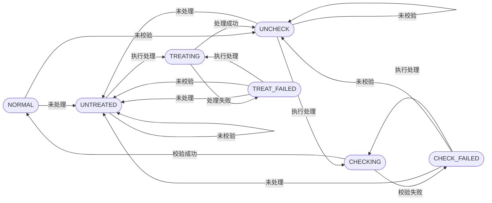

# 架构设计

## 系统结构

采用三端分离的架构

### web

 - 网页前端，通过 HTTP/HTTPS 协议与 server 进行通信

### server

 - 负责与前端进行 HTTP/HTTPS 协议通信
 - 负责逻辑任务与定时任务的处理
 - 与 judge 通过 TCP 长链接与非阻塞 IO 进行通信
 - 负责文件的管理和数据库的连接
 - 使用四层架构进行搭建
     * Controller
         + 主要负责创建与更新上下文，例如用户信息等，进行泛用的权限约束，对部分高频 API 进行缓冲，限制部分 API 的调用频率
     * Servicer(Biz)
         + 所有逻辑相关的内容均在此处
     * Mananger
         + 负责处理多级缓存问题，使得上层对缓存数据与持久化数据无感
     * Repository(Repo/Mapper)
         + 直接与数据库进行连接，存储持久化或非持久化数据

### judge

 - 负责进行程序的编译和运行

## 存储结构

所有模块的需要索引的信息和部分短字段均存储至 MySQL，非短字段或者非需要索引字段均存储至 Mongo，Redis 仅用于缓存且不采用持久化

# 模块设计

判断模块从属规则：基于哪个实体的数据进行逻辑判断

## 用户模块

### 用户属性

 - id。唯一不变的用户标识
 - handle: 用户名。表示用户的唯一标识，匹配 `^[a-zA-Z0-9_\-]{4,15}$`，通常情况下不允许更新
 - password: 密码。匹配 `^[a-zA-Z0-9_\-@#$%^&*~',./?:]{6,16}$`
 - type: 类型。默认为 `NORMAL`，表示用户的类型
 - organization: 组织。用户一定属于某个组织，组织按层级高层级对低层级有管理权，对同层级没有管理权，管理关系以 DAG 图表示。能够进行管理的组织可以调整对方的所在组织和所拥有的权限
 - permissionTypeSet: 权限列表。用户拥有的权限

| 权限 | 名称 | 功能 |
|:-:|:-:|:-:|
| CHANGE\_ORGANIZATION | 修改用户组织权 | 能够让一个受你管理的组织下的一个用户的组织转为一个新的受你管理的组织下 |
| GRANT | 分发权限 | 将自己拥有的权限同时授权给一个受你管理的组织下的一个用户，或者从他手里收回此权限 |
| VIEW\_HIDDEN\_PROBLEM | 查看隐藏题目权 | 拥有题库查看、题库提交、比赛链接隐藏题目的权利，同时也可以下载公开、隐藏题目的数据 |
| CREATE\_AND\_EDIT\_PROBLEM | 创建编辑自己拥有的题目 | 可以创建题目，同时可以编辑自己拥有的题目 |
| EDIT\_NOT\_OWNER\_PROBLEM | 编辑可访问的题目 | 可以随意编辑任何可以查看的题目 |
| VIEW\_PUBLIC\_SOLUTION | 查看公开的所有提交 | 可以查看公开的所有提交 |
| VIEW\_SOLUTION\_MESSAGE | 查看提交的运行信息 | 查看提交的运行信息 |
| MANAGER\_JUDGE | 管理判题系统 | 管理判题系统 |

 - submission: 总提交数
 - accept: 总通过数
 - email: 邮箱。用于找回密码和后续的通知信息，在第一次版本迭代中不发挥作用

### 用户功能

 - 登录
     * 前端提供
         + handle
         + password
     * 后端逻辑
         + 检查用户密码是否正确
         + 登录成功
         + 写入用户信息至 HTTP 会话中
 - 注册
     * 前端提供
         + handle
         + password
     * 后端逻辑
         + 检查用户的 handle 是否唯一
         + 注册用户
         + 写入用户信息至 HTTP 会话中
 - 调整对方所属组织（需要 CHANGE\_ORGANIZATION）
     * 前端提供
         + 目标用户
         + 目标组织
     * 后端逻辑
         + 校验当前用户是否可以管理目标用户
         + 校验当前用户是否可以管理目标组织
         + 修改目标的组织
 - 授予权限（需要 GRANT 权限）
     * 前端提供
         + 目标用户
         + 目标权限
     * 后端校验
         + 校验当前用户是否可以管理目标用户
         + 校验当前用户是否可以拥有目标权限
         + 增加目标用户新权限
 - 收回权限（需要 GRANT 权限）
     * 前端提供
         + 目标用户
         + 目标权限
     * 后端校验
         + 校验当前用户是否可以管理目标用户
         + 校验当前用户是否可以拥有目标权限
         + 删除目标用户的权限

## 问题模块

### 问题属性
 - id。唯一不变的题目标识符
 - title: 题目标题。可以被搜索
 - statusType: 题目状态

| 状态 | 名称 | 描述 |
| :-: | :-: | :-: |
| NORMAL | 正常 | 标准的题目，仅此状态可以进行提交 |
| UNTREATED | 未处理 | 未进行生成 output 文件 |
| TREATING | 处理中 | 正在生成 output 文件 |
| UNCHECK | 未校验 | 未校验标准代码 |
| CHECKING | 校验中 | 正在校验标准代码 |
| TREAT\_FAILED | 处理失败 | 处理失败，无法生成 output 文件 |
| CHECK\_FAILED | 校验失败 | 校验失败，不满足期望的标准代码通过情况 |




 - accessType: 题目的访问权限

 | 访问权限 | 名称 | 在题库中查看和提交 | 比赛链接 |
 | :-: | :-: | :-: | :-: |
 | PUBLIC | 公开的 | 均可 | 均可 |
 | HIDDEN | 隐藏的 | 仅拥有查看权限的人 | 仅拥有查看权限的人 |
 | PRIVATE | 私有的 | 仅拥有者 | 仅拥有者 |

 - submissionCount: 总提交数，历史上所有的提交数
 - acceptCount: 总通过数，历史上所有的通过数
 - owner: 指向用户的 id
 - contestId: 链接到的比赛 ID（仅保存第一次链接到的比赛）
 - defaultTimeLimit: 默认的超时限制
 - defaultMemoryLimit: 默认的内存超限
 - specialTimeLimit: 部分特殊语言的特殊时间限制
 - specialMemoryLimit: 部分特殊语言的特殊内存限制
 - supportLanguage: 允许提交的语言类型
 - description: 题目描述
 - input: 输入描述
 - output: 输出描述
 - example: 输入输出样例
 - type: 题目类型。默认为 `Normal`，用于后续增加交互题的能力
 - judgeCodeType: 使用的 judge 代码类型
 - judgeCode: 若为 DIY judge 模式，则为 judge 的代码
 - testName: 测试数据文件名。仅文件名，没有扩展名部分，存储至磁盘而非数据库，输入输出对应为 XXX.in, XXX.out
 - shareTest: 允许公开下载数据
 - stdCode: 标准代码，包含代码内容和最终结果，必须是正确通过的代码
 - testCodeList: 测试代码，包含代码内容、预期结果和最终结果，最终结果包含耗时、耗内存、结果。标准代码仅表示可能的代码，并非一定是通过的代码，也可以是期望不要通过的代码，但是必须至少有一个是期望通过的代码
 - version: 题目版本。每次将题目进入未处理态时，将会增加一个版本号，用来区别题目版本
 - gmtModifyTime: 题目的最后更新时间

### 问题功能

 - 查看题目列表
     * 未登陆用户
         + 返回 PUBLIC 题目列表
     * 登陆的普通用户
         + 返回 PUBLIC 和用户拥有的题目列表
     * 登陆的普通用户且有 VIEW\_HIDDEN\_PROBLEM 权限
         + 返回 PUBLIC、HIDDEN 和用户拥有的题目列表
 - 查看题目详情
     * 前端提供
         + 题目的 ID
     * 未登陆用户
         + 检查此题目是否是 PUBLIC 的
         + 返回题目详情
     * 登陆的普通用户
         + 检查题目是否是 PUBLIC 的或者此题目是否是当前用户拥有的
         + 返回题目详情
     * 登陆的普通用户且有 VIEW\_HIDDEN\_PROBLEM 权限
         + 检查题目是否是 PUBLIC 或者 HIDDEN 或者当前用户拥有此题目
         + 返回题目详情
 - 查看题目输入输出文件列表
     * 前端提供
         + 题目的 ID
     * 未登陆用户
         + 检查题目是否是 PUBLIC 的
         + 检查题目是否 shareTest
         + 返回题目输入输出文件列表
     * 登陆的普通用户
         + 检查（题目是否是 PUBLIC 的且为 shareTest）或者（此题目是当前用户拥有的）
         + 返回题目输入输出文件列表
     * 登陆的普通用户且有 VIEW\_HIDDEN\_PROBLEM 权限
         + 检查（题目是否是 PUBLIC 或者 HIDDEN）或者（此题目是当前用户拥有的）
         + 返回题目输入输出文件列表
 - 预览题目的输入文件
     * 前端提供
         + 题目的 ID
         + 输入数据的名称
     * 未登陆用户
         + 检查题目是否是 PUBLIC 的
         + 检查题目是否 shareTest
         + 返回题目输入文件内容的前 1000 个字符
     * 登陆的普通用户
         + 检查（题目是否是 PUBLIC 的且为 shareTest）或者（此题目是当前用户拥有的）
         + 返回题目输入文件内容的前 1000 个字符
     * 登陆的普通用户且有 VIEW\_HIDDEN\_PROBLEM 权限
         + 检查（题目是否是 PUBLIC 或者 HIDDEN）或者（此题目是当前用户拥有的）
         + 返回题目输入文件内容的前 1000 个字符
 - 预览题目的输出文件
     * 前端提供
         + 题目的 ID
         + 输出数据的名称
     * 未登陆用户
         + 检查题目是否是 PUBLIC 的
         + 检查题目是否 shareTest
         + 检查题目状态是否是正常
         + 返回题目输出文件内容的前 1000 个字符
     * 登陆的普通用户
         + 检查（题目是否是 PUBLIC 的且为 shareTest）或者（此题目是当前用户拥有的）
         + 检查题目状态是否是正常
         + 返回题目输出文件内容的前 1000 个字符
     * 登陆的普通用户且有 VIEW\_HIDDEN\_PROBLEM 权限
         + 检查（题目是否是 PUBLIC 或者 HIDDEN）或者（此题目是当前用户拥有的）
         + 检查题目状态是否是正常
         + 返回题目输出文件内容的前 1000 个字符
 - 下载题目的输入文件
     * 前端提供
         + 题目的 ID
         + 输入数据的名称
     * 未登陆用户
         + 检查题目是否是 PUBLIC 的
         + 检查题目是否 shareTest
         + 返回题目输入文件内容
     * 登陆的普通用户
         + 检查（题目是否是 PUBLIC 的且为 shareTest）或者（此题目是当前用户拥有的）
         + 返回题目输入文件内容
     * 登陆的普通用户且有 VIEW\_HIDDEN\_PROBLEM 权限
         + 检查（题目是否是 PUBLIC 或者 HIDDEN）或者（此题目是当前用户拥有的）
         + 返回题目输入文件内容
 - 下载题目的输出文件
     * 前端提供
         + 题目的 ID
         + 输出数据的名称
     * 未登陆用户
         + 检查题目是否是 PUBLIC 的
         + 检查题目是否 shareTest
         + 检查题目状态是否是正常
         + 返回题目输出文件内容
     * 登陆的普通用户
         + 检查（题目是否是 PUBLIC 的且为 shareTest）或者（此题目是当前用户拥有的）
         + 检查题目状态是否是正常
         + 返回题目输出文件内容
     * 登陆的普通用户且有 VIEW\_HIDDEN\_PROBLEM 权限
         + 检查（题目是否是 PUBLIC 或者 HIDDEN）或者（此题目是当前用户拥有的）
         + 检查题目状态是否是正常
         + 返回题目输出文件内容
 - 创建题目内容（需要权限 CREATE\_AND\_EDIT\_PROBLEM）
     * 前端提供
         + 题目标题
         + 题目描述
         + 输入描述
         + 输出描述
         + 输入输出样例
     * 后端逻辑
         + 创建题目内容
         + 更新题目的修改时间
 - 修改题目内容（需要权限 CREATE\_AND\_EDIT\_PROBLEM）
     * 前端提供
         + 题目 ID
         + 题目标题
         + 题目描述
         + 输入描述
         + 输出描述
         + 输入输出样例
     * 后端逻辑
         + 检查（当前用户是否拥有此题目）或者（此题目可以被用户访问到且拥有 EDIT\_NOT\_OWNER\_PROBLEM 权限）
         + 修改题目内容
         + 更新题目的修改时间
 - 修改题目配置（需要权限 CREATE\_AND\_EDIT\_PROBLEM）
     * 前端提供
         + 题目 ID
         + 题目访问权限
         + 允许提交的语言类型
         + 默认的时间超限设置
         + 默认的内存超限设置
         + 部分语言的特殊时间限制
         + 部分语言的特殊时间限制
         * 是否允许公开下载测试数据
         + 题目类型
     * 后端逻辑
         + 检查（当前用户是否拥有此题目）或者（此题目可以被用户访问到且拥有 EDIT_NOT_OWNER_PROBLEM 权限）
         + 检查当前题目状态不在“处理中”
         + 修改题目内容
         + 若满足下列条件之一
             - 允许提交的语言类型范围缩小
             - 默认的时间超限设置变小或特殊的时间限制变小至小于任何之前的标准代码中满足语言条件的、有结果的、且期望通过的时间使用
             - 默认的内存超限设置变小或特殊的内存限制变小至小于任何之前的标准代码中满足语言条件的、有结果的、且期望通过的内存使用
             - 题目类型变更
         + 则将当前题目的状态进入未校验
         + 更新题目的修改时间
 - 修改题目的 judge 配置（需要权限 CREATE\_AND\_EDIT\_PROBLEM）
     * 前端提供
         + 题目 ID
         + 新的 Judge 模式
         + 自定义的 Judge 代码
     * 后端逻辑
         + 检查（当前用户是否拥有此题目）或者（此题目可以被用户访问到且拥有 EDIT_NOT_OWNER_PROBLEM 权限）
         + 检查当前题目不在“校验中”
         + 修改题目 judge 配置
         + 则将当前题目的状态进入未校验，若原来不在未校验中，则同时增加一个版本号
         + 更新题目的修改时间
 - 上传题目的 Test 输入数据（需要权限 CREATE\_AND\_EDIT\_PROBLEM）
     * 前端提供
         + 输入文件
         + 输入名称
     * 后端逻辑
         + 检查（当前用户是否拥有此题目）或者（此题目可以被用户访问到且拥有 EDIT_NOT_OWNER_PROBLEM 权限）
         + 检查当前题目不在“处理中”，且不在“校验中”
         + 修改题目的 Test 数据
         + 保存 Test 数据文件
         + 则将当前题目的状态进入未处理，若原来不是未处理，则版本 + 1，并添加至缓存删除列表
         + 更新题目的修改时间
 - 删除题目的 Test 数据（需要权限 CREATE\_AND\_EDIT\_PROBLEM）
     * 前端警告
         + 当前操作不可撤销，确定继续删除 ${文件名列表}
     * 前端提供
         + 题目 ID
         + 需要删除的测试数据名称列表
     * 后端逻辑
         + 检查（当前用户是否拥有此题目）或者（此题目可以被用户访问到且拥有 EDIT_NOT_OWNER_PROBLEM 权限）
         + 检查当前题目不在“处理中”，且不在“校验中”
         + 修改题目的 Test 数据
         + 删除 Test 数据文件
         + 则将当前题目的状态进入未校验
         + 更新题目的修改时间
 - 查看标准/测试代码列表（需要权限 CREATE\_AND\_EDIT\_PROBLEM）
     * 前端提供
         + 题目 ID
     * 后端逻辑
         + 检查（当前用户是否拥有此题目）或者（此题目可以被用户访问到且拥有 EDIT_NOT_OWNER_PROBLEM 权限）
         + 返回标准代码内容和预期结果和目前结果
 - 变更标准代码（需要权限 CREATE\_AND\_EDIT\_PROBLEM）
     * 前端提供
         + 题目 ID
         + 代码内容
         + 代码语言
     * 后端逻辑
         + 检查（当前用户是否拥有此题目）或者（此题目可以被用户访问到且拥有 EDIT_NOT_OWNER_PROBLEM 权限）
         + 检查当前题目不在“处理中”
         + 保存新的标准代码
         + 则将当前题目的状态进入未处理，若原来不是未处理，则版本 + 1，并添加至缓存删除列表
 - 上传测试代码（需要权限 CREATE\_AND\_EDIT\_PROBLEM）
     * 前端提供
         + 题目 ID
         + 代码内容
         + 代码语言
         + 代码名：不可以为 `STD`
         + 预期结果
     * 后端逻辑
         + 检查（当前用户是否拥有此题目）或者（此题目可以被用户访问到且拥有 EDIT_NOT_OWNER_PROBLEM 权限）
         + 检查当前题目不在“校验中”
         + 检查代码名是否为 `STD`
         + 保存新的标准代码
         + 则将当前题目的状态进入未校验
 - 删除测试代码（需要权限 CREATE\_AND\_EDIT\_PROBLEM）
     * 前端提供
         + 题目 ID
         + 代码名
     * 后端逻辑
         + 检查（当前用户是否拥有此题目）或者（此题目可以被用户访问到且拥有 EDIT_NOT_OWNER_PROBLEM 权限）
         + 检查当前题目不在“校验中”
         + 保存新的标准代码
         + 则将当前题目的状态进入未校验
 - 预览标准/测试代码（需要权限 CREATE\_AND\_EDIT\_PROBLEM）
     * 前端提供
         + 题目 ID
         + 代码名
     * 后端逻辑
         + 检查（当前用户是否拥有此题目）或者（此题目可以被用户访问到且拥有 EDIT_NOT_OWNER_PROBLEM 权限）
         + 返回标准代码内容和预期结果和目前结果
 - 下载标准/测试代码（需要权限 CREATE\_AND\_EDIT\_PROBLEM）
     * 前端提供
         + 题目 ID
         + 代码名
     * 后端逻辑
         + 检查（当前用户是否拥有此题目）或者（此题目可以被用户访问到且拥有 EDIT_NOT_OWNER_PROBLEM 权限）
         + 返回标准代码内容
 - 执行处理校验（需要权限 CREATE\_AND\_EDIT\_PROBLEM）
     * 前端提供
         + 题目 ID
     * 后档逻辑
         + 检查（当前用户是否拥有此题目）或者（此题目可以被用户访问到且拥有 EDIT_NOT_OWNER_PROBLEM 权限）
         + 检查当前是否不是正常，且不在“处理中”，且不在“校验中”
         + 放入任务列表
 - 提交公共代码
     * 前端提供
         + 代码
         + 语言
         + 所提交的题目 ID
     * 后端逻辑
         + 检查当前用户是否有权限访问此题目
         + 检查语言是否规范
         + 检查代码长度是否规范
         + 创建新的提交并推入 judge 任务

## 提交模块

### 提交属性

 - id。唯一不变的提交标识符
 - submitTime: 提交时间
 - userId: 提交的用户 ID
 - problemId: 提交至的问题 ID
 - contestId: 提交至的比赛 ID
 - languageType: 提交的语言类型
 - status: 当前状态
 - solutionType: 提交的类型。公开的提交，在比赛中提交，系统测试程序
 - timeCost: 耗时
 - memoryCost: 内存消耗
 - code: 代码内容
 - compileMsg: 编译信息
 - runningMsg: Judge 反馈的信息
 - runOnVersion: 执行 Judge 时的题目版本

### 提交功能

 - 查看公共提交列表
     * 前端提供
         + 过滤的用户 handle
         + 过滤的题目 ID
         + 过滤的状态
         + 列表页码
         + 每一页的数量
     * 后端逻辑
         + 检查每一页数量是否在要求范围内
         + 获取所有的公共提交总量
         + 检查页码是否在范围内
         + 获取指定页码的数据并返回
 - 查看公共提交详情
     * 前端提供
         + 需要查看的代码 ID
     * 后端逻辑
         + 检查当前用户是否有权限访问此题目
         + 返回提交详情
 - 执行 rejudge
     * TODO 项目

## 判题模块

### 判题模块名词解释

 - judge 任务
     * 一个评测提交的任务，包括编译、对所有测试用例的运行
 - test 任务
     * 生成题目的正确输出的任务
 - Judge
     * 一个评测机器

### Judge 机器属性

 - judgeCode: 判题机器的唯一编码
 - maxThreadCore: 最大工作线程数
 - maxWorkCore: 最大任务线程数
 - maxSocketCore: 最大连接池数
 - threadAccumulation: 任务线程堆积数
 - workAccumulation: 任务池堆积任务数量
 - socketAccumulation: 连接池堆积任务数量
 - isNewCore: 是否更新了的 thread core 或者 socket core 或者 work core 的值，且未向 Judge 同步
 - maxWorkNum: 同步最大任务数量
 - lastHeartbeat: 最后一次心跳包时间
 - judgeWorkMap: 正在进行中的 judge 任务
 - testWorkMap: 正在进行中的 test 任务
 - tcpAddressSet: 所有连接的 TCP
 - needDeleteProblemCacheIdList: 因为更新题目信息而删除题目的缓存

### Judge 功能

 - 获取 server code（需要 VIEW_SERVICE_CODE）
     * 提供 server code
 - 获取当前 Judge 机器列表（需要 VIEW_SERVICE_CODE）
     * 提供 Judge 列表
 - 更新 Judge 的配置信息（需要 VIEW_SERVICE_CODE）
     * 前端提供
         + 更新目标 Judge 的编码
         + 新的最大工作线程数
         + 新的最大任务线程数
         + 新的最大连接池数
         + 新的同步最大任务数量
     * 后端
         + 更新对应 Judge 的配置信息
 - 手动终止一个 Judge 任务（需要 VIEW_SERVICE_CODE）
     * 前端提供
         + solution ID
     * 后端
         + 终止对应的任务
 - 手动终止一个 Test 任务（需要 VIEW_SERVICE_CODE）
     * 前端提供
         + problem ID
     * 后端
         + 终止对应任务
 - 等待一个 judge 完成最后的判题任务后，关闭一个 Judge（需要 VIEW_SERVICE_CODE）
     * 关闭掉一个 Judge 容器，让 Judge 在完成其所有的判题后推出

# 存储设计

## 用户模块

### MySQL

```sql
CREATE TABLE account
(
    id       BIGINT      AUTO_INCREMENT NOT NULL COMMENT '用户 ID',
    data_id  VARCHAR(32)                    NULL COMMENT '用户数据主键',
    handle   VARCHAR(64)                NOT NULL COMMENT '用户名',
    password VARCHAR(64)                NOT NULL COMMENT '用户密码',
    type     VARCHAR(64)                NOT NULL COMMENT '用户类型',
    PRIMARY KEY (`id`),
    UNIQUE KEY uk_handle(`handle`)
) ENGINE=InnoDB DEFAULT CHARSET=utf8mp4 COLLATION=utf8mb4_general_ci COMMENT '用户基本信息表';
```

### Mongo

```java
public class NormalUserData {

    /**
     * 数据库主键
     */
    @Id
    private String _id;

    /**
     * 所属组织
     */
    private OrganizationType organization;

    /**
     * 总提交数量
     */
    private Integer submission;

    /**
     * 总通过数量
     */
    private Integer accept;

    /**
     * 权限列表
     */
    private Set<PermissionType> permissionTypeSet;

    /**
     * 邮箱
     */
    private String email;
}
```

## 题目模块

### MySQL

```sql
CREATE TABLE problem
(
    id                  BIGINT          AUTO_INCREMENT  NOT NULL COMMENT '题目 ID',
    data_id             VARCHAR(32)                         NULL COMMENT '题目数据主键',
    title               VARCHAR(256)                    NOT NULL COMMENT '题目的标题',
    status_type         VARCHAR(64)                     NOT NULL COMMENT '题目状态',
    access_type         VARCHAR(64)                     NOT NULL COMMENT '访问权限',
    submission_count    INT             DEFAULT 0       NOT NULL COMMENT '总提交数',
    accept_count        INT             DEFAULT 0       NOT NULL COMMENT '通过的提交数',
    owner               BIGINT                          NOT NULL COMMENT '题目拥有者',
    PRIMARY KEY (`id`),
    UNIQUE KEY uk_title(`title`)
) ENGINE=InnoDB DEFAULT CHARSET=utf8mp4 COLLATION=utf8mb4_general_ci COMMENT '题目基本信息表';
```

### Mongo

```java
public class ProblemData {

    @Id
    private String _id;

    /**
     * 首次关联至的比赛 ID
     */
    private Long contestId;

    /**
     * 默认的耗时限制，单位（ms）
     */
    private Integer defaultTimeLimit;

    /**
     * 默认的内存限制，单位（mb）
     */
    private Integer defaultMemoryLimit;

    /**
     * 部分语言的特殊时间限制
     */
    private Map<LanguageType, Integer> specialTimeLimit;

    /**
     * 部分语言的特殊内存限制
     */
    private Map<LanguageType, Integer> specialMemoryLimit;

    /**
     * 允许使用的语言类型
     */
    private List<LanguageType> supportLanguage;

    /**
     * 题目描述
     */
    private String description;

    /**
     * 输入描述
     */
    private String input;

    /**
     * 输出描述
     */
    private String output;

    /**
     * 输入输出样例
     */
    private List<Example> example;

    /**
     * 题目类型
     */
    private ProblemType type;

    /**
     * judge 模式
     */
    private JudgeCodeType judgeCodeType;

    /**
     * DIY judge code
     */
    private String judgeCode;

    /**
     * 测试样例的名称，允许给不同的样例准备不同的名称，输入为 XXX.in，输出为 XXX.out，交互题只有输入
     */
    private List<String> testName;

    /**
     * 是否允许下载样例
     */
    private Boolean shareTest;

    /**
     * 标准代码，必定为通过
     */
    private StdCode stdCode;

    /**
     * 测试代码（并不一定是通过，可能是故意错误的，但是一定有一份是通过的）
     */
    private List<StdCode> testCodeList;

    /**
     * 题目版本号
     */
    private Integer version;

    /**
     * 题目最后更新时间
     */
    private Date gmtModifyTime;

    @Data
    @Builder
    public static class Example {

        /**
         * 样例输入（原始文件格式 \n 表示换行）
         */
        private String in;

        /**
         * 样例输出（原始文件格式 \n 表示换行）
         */
        private String out;
    }

    @Data
    @Builder
    public static class StdCode {

        /**
         * 文件名
         */
        private String name;

        /**
         * 代码
         */
        private String code;

        /**
         * 期望结果
         */
        private SolutionStatusType expectResultType;

        /**
         * 所使用的语言
         */
        private LanguageType languageType;

        /**
         * 最终的测试 ID
         */
        private Long solutionId;

        public void reset() {
            this.solutionId = null;
        }
    }
}
```

## 提交模块

### MySQL

```sql
CREATE TABLE solution
(
    id                  BIGINT          AUTO_INCREMENT  NOT NULL COMMENT '题目 ID',
    data_id             VARCHAR(32)                         NULL COMMENT '题目数据主键',
    submit_time         date                            NOT NULL COMMENT '题目的标题',
    user_id             BIGINT                              NULL COMMENT '提交的用户 ID',
    problem_id          BIGINT                          NOT NULL COMMENT '提交至的问题 ID',
    contest_id          BIGINT                              NULL COMMENT '提交至的比赛 ID',
    language_type       VARCHAR(64)                     NOT NULL COMMENT '提交的语言类型',
    status              VARCHAR(64)                     NOT NULL COMMENT '当前状态',
    solution_type       VARCHAR(64)                     NOT NULL COMMENT '提交的类型。公开的提交，在比赛中提交，系统测试程序',
    time_cost           INT                                 NULL COMMENT '耗时',
    memory_cost         INT                                 NULL COMMENT '内存消耗',           
    PRIMARY KEY (`id`)
) ENGINE=InnoDB DEFAULT CHARSET=utf8mp4 COLLATION=utf8mb4_general_ci COMMENT '提交基本信息';
```

### Mongo
```java
public class SolutionData {

    /**
     * Mongo ID
     */
    @Id
    private String _id;

    /**
     * 代码内容
     */
    private String code;

    /**
     * 编译信息
     */
    private String compileMsg;

    /**
     * 运行中 judge 反馈信息
     */
    private Map<String, String> runningMsg;

    /**
     * 运行的版本号
     */
    private Integer runOnVersion;
}
```

# TCP 数据格式

Judge 和 Service 通过超长时间的 TCP 连接，并通过应答的方式，由 Judge 向 Service 发送请求，Service 应答。Judge 通过向 Service 发送注册指令在 Service 上完成注册，然后可以获取到一个唯一表示当前 Judge 机的编码，之后 Judge 可以使用多个新增 TCP 连接的方式实现建立多条 TCP 连接并绑定至同一个 Judge 上

## 通用格式

### Request
```
BEGIN
${METHOD}
${DATA}
END
```

### Response

```
${CODE}
${DATA}
```

### 格式说明

其中 DATA 数据使用分块传输编码的方式进行编码

每一个块都以一个该块包含的字节数（以十进制整数表示）开始，跟随一个 LF 换行符，然后是数据本身，最后以一个 LF 结束，且结束的 LF 不在字节数长度内。最后一个块必定是一个字节数为 0 的块，消息最后以 LF 结尾。即类似如下内容

```
${len1}
${data1}
${len2}
${data2}
0
```

将所有块的数据拼接后可以得到完整的数据内容，数据有三种格式，为前后端约定，分别为 **单数据** **简单数据** 和 **复杂数据**，同时规定在后续开发中，尽量避免使用复杂数据结构

#### 单数据

```
${value}
```

直接显示值，此方式适用于返回值仅有一个值的情况，或者是仅有一个数组/集合的情况，仅用于返回值

#### 简单数据

```
${key} ${value}
```

为一个 `key` 和一个 `value`，表示 `key` 的值是 `value`，中间使用空格分割，最后以 LF 作为结束符号。此时，`value` 部分长度不应该超过 200 个字符

#### 复杂数据

```
${key} ${len}
${value}
```

首先是一个 `key` 和 `len`，表示这个 `key` 的值长度为 `len`，然后是一个 LF 换行符，再紧接着的是整个值的信息，最后以 LF 作为结束符号。通常用在简单数据中存在换行、空格的数据情况下使用，仅用于请求值

Response 返回时还会携带状态码，若状态码为非 0 则为错误

## API 接口说明

标题即为请求调用的方法

### Register

向目标 Service 注册本 Judge 机

#### 请求参数

| 参数 | 描述 | 使用的数据类型 |
|:-:|:-:|:-:|
| serverCode | 目标服务器给出的随机服务串，用来认定 Judge 是来自可信任的人启动并连接至此的 | 简单数据 |
| maxThreadCore | 最大任务线程池大小 | 简单数据 |
| maxSocketCore | 最大通信线程池大小 | 简单数据 |
| maxWorkCore | 最大任务线程池大小 | 简单数据 |

#### 返回信息

| 参数 | 描述 | 使用的数据类型 |
|:-:|:-:|:-:|
| judgeCode | 表示当前 Judge 的口令 | 单数据 |

### Append

通知服务器新增加一个 TCP 连接，并与现有的 TCP 所指向的 Judge 绑定

#### 请求参数

| 参数 | 描述 | 使用的数据类型 |
|:-:|:-:|:-:|
| judgeCode | 表示当前 Judge 的口令 | 简单数据 |

#### 返回信息

无返回信息

### Heartbeat

心跳数据包

#### 请求参数

| 参数 | 描述 | 使用的数据类型 |
|:-:|:-:|:-:|
| threadAccumulation | 堆积的小任务数据量 | 简单数据 |
| socketAccumulation | 堆积的通信数据量 | 简单数据 |
| workAccumulation | 堆积的任务数据量 | 简单数据 |

#### 返回信息

| 参数 | 描述 | 使用的数据类型 |
|:-:|:-:|:-:|
| judgeTask | 需要进行 judge 的编号，可重复出现，表示多个任务 | 简单数据 |
| testTask | 需要生成 test 数据的 problem 编号，可重复出现，表示多个任务 | 简单数据 |
| threadCore | 更新最大线程池数量，为更新至的值，可以为空 | 简单数据 |
| socketCore | 更新最大连接池数量，为更新至的值，可以为空 | 简单数据 |
| workCore | 更新最大任务线程池数量，为更新至的值，可以为空 | 简单数据 |
| cleanProblem | 需要删除的题目数据 | 简单数据 |

### SolutionInfo

获取 Judge 任务的信息

#### 请求参数

| 参数 | 描述 | 使用的数据类型 |
|:-:|:-:|:-:|
| id | 提交的 ID | 简单数据 |

#### 返回信息

| 参数 | 描述 | 使用的数据类型 |
|:-:|:-:|:-:|
| problemId | 提交对应的题目 ID | 简单数据 |
| language | 使用的语言 | 简单数据 |
| judgeName | 使用的 judge 模式 | 简单数据 |
| testNum | 测试数据量 | 简单数据 |
| timeLimit | 时间限制 | 简单数据 |
| memoryLimit | 内存限制 | 简单数据 |

### SolutionTest

获取评测 Solution 的下一组测试名称

#### 请求参数

| 参数 | 描述 | 使用的数据类型 |
|:-:|:-:|:-:|
| id | 对应提交 ID | 简单数据 |

#### 返回信息

| 参数 | 描述 | 使用的数据类型 |
|:-:|:-:|:-:|
| name | 下一组测试数据名称 | 单数据 |

### SolutionTestReport

提交评测 Solution 的信息

#### 请求参数

| 参数 | 描述 | 使用的数据类型 |
|:-:|:-:|:-:|
| value | 对应运行的结果 | 简单数据 |
| testName | 运行的测试名称 | 简单数据 |
| msg | 对应运行产生的信息 | 复杂数据 |
| id | 对应提交 ID | 简单数据 |
| timeCost | 对应提交的耗时 | 简单数据 |
| memoryCost | 对应提交的内存消耗 | 简单数据 |

#### 返回信息

| 参数 | 描述 | 使用的数据类型 |
|:-:|:-:|:-:|
| continue | 是否结束评测 | 单数据 |

### SolutionCompileMsgReport

提交评测 Solution 的编译信息

#### 请求参数

| 参数 | 描述 | 使用的数据类型 |
|:-:|:-:|:-:|
| id | 对应提交 ID | 简单数据 |
| value | 对应 code 编译是否成功的信息 | 简单数据 |
| judge | 对应 judge 编译是否成功的信息 | 简单数据 |
| data | 编译信息 | 复杂数据 |

#### 返回信息

无返回信息

### SolutionCode

提交的代码

#### 请求参数

| 参数 | 描述 | 使用的数据类型 |
|:-:|:-:|:-:|
| id | 提交的 ID | 简单数据 |

#### 返回信息

| 参数 | 描述 | 使用的数据类型 |
|:-:|:-:|:-:|
| code | 提交的代码 | 单数据 |

### StandardJudge

获取默认的 Judge 列表

#### 请求参数

无请求参数

#### 返回信息

| 参数 | 描述 | 使用的数据类型 |
|:-:|:-:|:-:|
| judgeNameList | 默认的 Judge 名称列表 | 单数据 |

### StandardJudgeCode

获取对应的默认 Judge 代码

#### 请求参数

| 参数 | 描述 | 使用的数据类型 |
|:-:|:-:|:-:|
| name | 默认的 Judge 名称 | 简单数据 |

#### 返回信息

| 参数 | 描述 | 使用的数据类型 |
|:-:|:-:|:-:|
| code | 默认的 Judge 代码 | 单数据 |

### ProblemJudgeCode

获取对应题目的自定义 Judge 代码

#### 请求参数

| 参数 | 描述 | 使用的数据类型 |
|:-:|:-:|:-:|
| id | 题目 ID | 简单数据 |

#### 返回信息

| 参数 | 描述 | 使用的数据类型 |
|:-:|:-:|:-:|
| code | 对应题目的 DIY Judge 代码 | 单数据 |

### ProblemDataIn

获取对应题目的输入文件

#### 请求参数

| 参数 | 描述 | 使用的数据类型 |
|:-:|:-:|:-:|
| id | 题目 ID | 简单数据 |
| name | 测试数据名称 | 简单数据 |

#### 返回信息

| 参数 | 描述 | 使用的数据类型 |
|:-:|:-:|:-:|
| test | 对应题目的测试输入数据 | 单数据 |

### ProblemDataOut

获取对应题目的输出文件

#### 请求参数

| 参数 | 描述 | 使用的数据类型 |
|:-:|:-:|:-:|
| id | 题目 ID | 简单数据 |
| name | 测试数据名称 | 简单数据 |

#### 返回信息

| 参数 | 描述 | 使用的数据类型 |
|:-:|:-:|:-:|
| test | 对应题目的测试输出数据 | 单数据 |

### TestInfo

获取 Test 任务的信息

#### 请求参数

| 参数 | 描述 | 使用的数据类型 |
|:-:|:-:|:-:|
| id | 题目的 ID | 简单数据 |

#### 返回信息

| 参数 | 描述 | 使用的数据类型 |
|:-:|:-:|:-:|
| language | 使用的语言 | 简单数据 |
| testNum | 测试数据量 | 简单数据 |
| timeLimit | 时间限制 | 简单数据 |
| memoryLimit | 内存限制 | 简单数据 |

### TestStdCode

获取生成测试的用的标准代码

#### 请求参数

| 参数 | 描述 | 使用的数据类型 |
|:-:|:-:|:-:|
| id | 题目的 ID | 简单数据 |

#### 返回信息

| 参数 | 描述 | 使用的数据类型 |
|:-:|:-:|:-:|
| code | 标准代码 | 单数据 |

### TestTest

获取评测 Test 的下一组测试名称

#### 请求参数

| 参数 | 描述 | 使用的数据类型 |
|:-:|:-:|:-:|
| id | problem ID | 简单数据 |

#### 返回信息

| 参数 | 描述 | 使用的数据类型 |
|:-:|:-:|:-:|
| name | 下一组测试数据名称 | 单数据 |

### TestReportOutput

上传输出文件

#### 请求参数

| 参数 | 描述 | 使用的数据类型 |
|:-:|:-:|:-:|
| id | 题目的 ID | 简单数据 |
| flag | 是否成功 | 简单数据 |
| name | 数据的名称 | 简单数据 |
| pos | 输出的偏移量 | 简单数据 |
| value | 输出的片段内容 | 复杂数据 |

#### 返回信息

无

### TestResultReport

通知服务器 stdCode 编译出现编译错误

#### 请求参数

| 参数 | 描述 | 使用的数据类型 |
|:-:|:-:|:-:|
| id | 题目的 ID | 简单数据 |

#### 返回信息

无

### TestReportOver

通知服务器，本题目的 test 生成已经成功完成

#### 请求参数

| 参数 | 描述 | 使用的数据类型 |
|:-:|:-:|:-:|
| id | 题目的 ID | 简单数据 |

#### 返回信息

无
