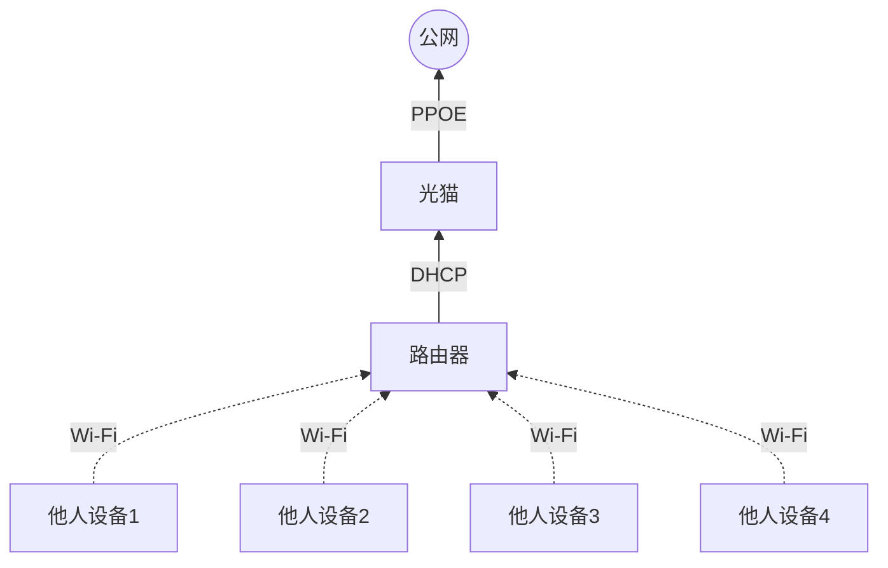
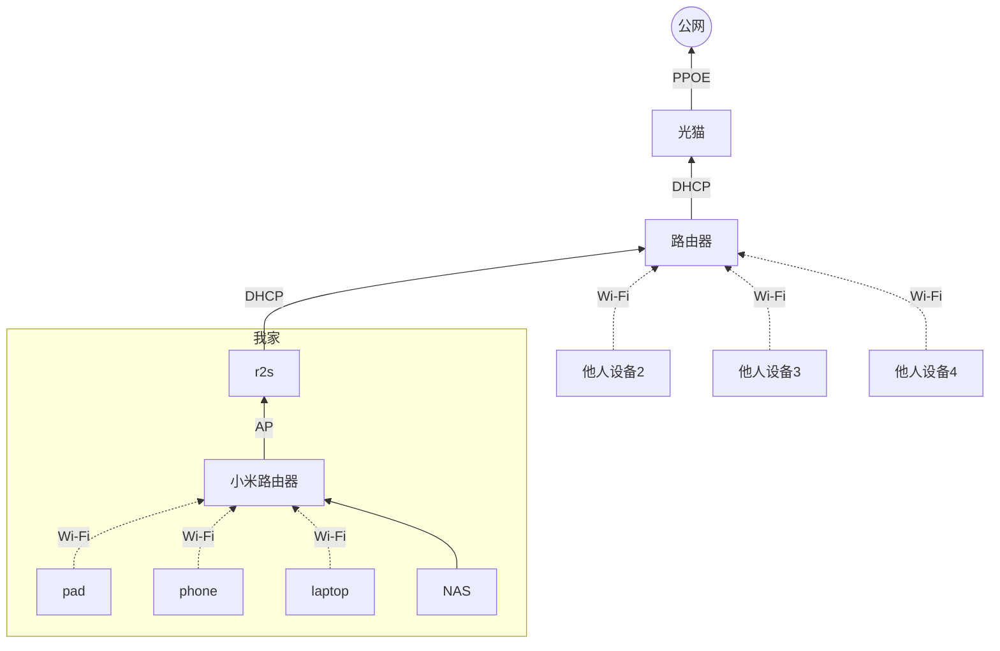

# 起因
最近有人问起我，关于我家里的 NAS 以及家庭网络搭建的情况，正好也闲来无事，打算写写目前的家庭网络部署情况

# 前置条件
首先，谈到家庭网络搭建，那必然需要先简单介绍一下生活基本情况：

 - 我目前主要居住在公司附近的小区，租了一个大房间，房间内仅有一个网孔。房东提供的不可撼动的网络布局很简单：光猫拨号上网，下面接一个路由器。
 - 路由器主要是起到交换机和 AP 的作用，并没有路由的意义，而后从路由器的 LAN 口出来的网线接入到每个房间的网孔上，恰好一个房间一个，当然，这个路由器也有 AP，所以也能提供 Wi-Fi，而且速度还不错。
 - 光猫很荣幸能够分配到公网的 IPv6 的一个子网段。
 - 通过盲猜了一波路由器的密码，发现其他合租人的设备是直接使用房东提供的 Wi-Fi，并没有做太多处理
 
 大概的网络拓扑长这样
 


同时，在爸妈家也有一套网络：

 - 家中则是独立房屋，房间较大，需要多个 AP 才能覆盖全房间
 - 但是入户光猫比较破烂，需要采购，且运营商能给到的带宽不高（毕竟都是爸妈承担费用，他们的目标就是能用就行）
 - 距离平时居住的地点路程较远，爸妈也不太懂这种东西，总不能出点事情就坐一路车回去就为了插根网线 or 刷个路由器吧
 
因此，主要也是将个人网络部署在租房内

另外，部署的过程也要符合个人的审美原则：

1. 必须是体验极佳，要用户无感以及快速入手，能够使用系统自带的应用程序就不用第三方的程序
2. 能多花一点钱就能减少折腾的，绝对不折腾

部署的目标也得罗列一下：
 - 家庭网络保证可用，所有设备都可以通过一个Wi-Fi接入网络
     - 比起网络线路的复杂，还是希望家中的网线不要太复杂，一个Wi-Fi，一切安好
 - 家庭局域网对国外IP/域名自动代理，对任何入网设备无感
     - 家中有一些设备并不适合下载代理软件，比如 switch，如果不在路由器上下点功夫，肯定没办法拥有很好的体验
     - 部分开发的时候需要用到设备自身的 VPN，比如连接到公司内网需要占用手机的 VPN，laptop 需要抓包的时候，也需要占用 VPN……为了避免这些行为发生的时候，无法继续享受 Google 作为默认搜索引擎的乐趣
 - NAS 需要提供任意地区访问的能力，即公网可以访问 NAS
     - 要是仅局域网访问，那还不如直接整个 U 盘便宜又简单，而且还

# 部署

## 家庭网络

网络方面的架构则比较简单，因为对这块的特殊需求比较少，当然也因为能够改造的方面比较少，所以也就采用简单的方案



- 由于房东包的网络带宽并不高，故直接买了一个 r2s，安装了 openwrt，同时在里面通过插件功能，实现全屋代理
- 然后买了一个小米路由器，开启 AP 模式，并直连到 r2s 上。不直接买普通的 AP 的目的，主要还是希望它还能发挥交换机的能力
- NAS 则通过网线直接和小米路由器连接，然后其他的设备也是通过 Wi-Fi 的方式连接到小米路由器上，使得家庭内网内的数据传输，仅需要通过小米路由器完成，虽然 r2s 的带宽并不高，但内网交换数据并不需要到 r2s 这一层

## NAS 搭建

接下来是 NAS 的部分

考虑到避免折腾以及后续真香的成本，我决定直接入手白群晖。选择的是四盘位的 DS423+ 这款。主要考虑到的也是使用的目的。


### 存储设置端

- 由于群晖会将第一个磁盘作为主系统盘，主要提供读取，故采用 SSD 放在第一个盘位能够非常有效的解决噪音问题
  - 恰好自己之前从坏掉的笔记本上拆下来了 SATA 接口的 2.5 寸 SSD 硬盘。这个硬盘单独创建一个 Basic 阵列，此盘不做任何容灾备份，主要就用来当缓存用
  - 但需要注意的是，群晖其实是在所有硬盘上创建了一个 RAID 1 的
- 剩下的三个盘作为主要存储，也是使用机械硬盘为主，并组建了 SHR 的磁盘整列

硬盘安装可以参考群晖给出的[文档](https://global.download.synology.com/download/Document/Hardware/HIG/DiskStation/20-year/DS920+/chs/Syno_HIG_DS920_Plus_chs.pdf)

SHR 比之余 RAID5 的好处，主要还是在于扩容的时候，只需要购买两张更大的硬盘就可以实现扩容，无需把所有硬盘都替换掉。至于性能和寿命？作为一个偏轻度的 NAS 使用者而言，似乎是一个无关痛痒的东西

将套件中心的存储空间和 Download Station 的缓存空间都设置到 SSD 盘，这样可以减少很多机械硬盘本身带来的噪音

### 网络配置

网络配置才是比较麻烦的操作

内网访问不必多说，主要是通过 HTTP 协议来管理，由于群晖提供的套件比较丰富，实际上你可以仅使用 HTTP 来管理文件、系统，当然，考虑到舒适的使用，还是需要用上 SMB 服务

测试了一下，房东的光猫的防火墙禁止了入网流量，导致无法直接在外网通过 IPv6 来访问到自己的 NAS。既然在没有考虑到要换新的房子的前提下，那就只能委曲求全，通过一些其他方案来访问内网

#### 方案一：QuickConnect

quick connect 可以说是非常完美的解决方案，它考虑内网直连、公网 IP 直连、UPNP 连接、打洞、转发等方案，一个地址走天下的方案，能够在任何场景下得到最好的访问途径，可以说 QuickConnect 是体验最好的方案……吗？来看看速度对比

为了对比速度，我测试了一个大文件在多种场景下的速度情况，测试文件是《铃芽之旅》2K 的 mkv 打包的视频，大小为 10.64GB（9.91GiB）足够传输个几秒钟了


测试环境，只用一根网线让 NAS 和路由器直连，然后由我的 laptop 通过 Wi-Fi 接入路由器，路由器本身开启 AP 模式。如果传输方式本身能够提供速度监控的话，那就按照监控本身为准，否则直接将 laptop 的整体网络下载速度为准

首先采用理论上 TCP 下最快的方案：在 NAS 上开启 tcp 监听，同时将输入流设置为视频文件，而后在本机上通过 tcp 直接连接到 NAS 的端口，并将结果写入到本地文件

```
# nas 上
nc -l 9090 < "~/Videos/Movies/Suzume/Suzume.2022.2160p.WEB-DL.H265.DDP5.1.2Audio-DreamHD.mkv"
# 本地机器
nc nas.com 9090 > "~/Download/Suzume.2022.2160p.WEB-DL.H265.DDP5.1.2Audio-DreamHD.mkv"
```

可惜的是群晖系统没有默认携带 netcat，再去下一个的意义不大，毕竟说白了也没人这么用 NAS 的，谁下载个东西都用 netcat 啊（虽然好像我经常这样给服务器传输文件）
当然也可以退而求其次，选择使用 SCP 的方式来拷贝文件，但也和上述问题一样：没有人平时会这样用 NAS，也就不再过多测试了

那就直接上 SMB 的下载吧


速度基本上可以稳点在 100MB/s+

然后是内网通过 HTTP 协议下载的速度


也差不多，这两者的误差几乎可以忽略

然后是 QuickConnect 的在最坏的情况下（采用转发的方案）外网访问速度，我才用了 5G 热点的方式接入，也是在外网最常见的访问场景


这就有点丢脸了，也是这个方案下最让人难以接受的原因

当然还有一个令人难以接受的就是，他强制会将你的文件分享地址改成 gofile.me 这个域名，看起来就让人不太舒服


#### DDNS 和 IPv6

这两个方案本是个人最喜欢的方案，没有什么比直接连接更加干净利索的了，但……目前的居住环境既拿不到公网的 IPv4 地址，又被光猫的防火墙拦截了 IPv6 的数据，这确实让人没办法接受

#### 内网穿透

最终，只能选择内网穿透方案。考虑采用 frp 作为内网穿透的方案

##### 外网访问配置

租一台阿里云的 ECS，在按量计费的阿里云 ECS 的成本确实很低，百兆带宽，也只要 1k 就能用 5 年，虽然流量挺贵，1GiB 需要 ¥0.8
但通常也不太会在外面直接看视频，毕竟要么还需要消耗手机的移动网络，要么是有预期要出远门，通常更多会提前下载在本地，比如坐飞机的时候。另外，一部电影 20G 的话，也花不了几块钱才是


然后通过 frp 的方式进行数据传输，简单起一个 docker 镜像。

`docker-compose.yml` 的大概信息

```
version: '3.3'
services:
  frps:
    restart: always
    network_mode: host
    volumes:
      - './frps.ini:/frp/frps.ini'
    container_name: frps
    image: stilleshan/frps
```

之所以选择 `network_mode` 为 `host` 的目的也是懒了，毕竟但凡来一个端口需要转发的，就又要再配置一下 docker 镜像的端口映射，确实有些麻烦了

`frps.ini` 配置信息

```
[common]
bind_port = 7000
token = XXXXX
```

`frpc.ini` 的配置参考信息

```
[common]
server_addr = nas.com  # 阿里云服务器的 IP/域名
server_port = 7000
token = XXXXX          # frp 的 token，和服务端配置一致即可

[nas_dsm_http]
type = tcp
local_ip = 127.0.0.1
local_port = 5000      # DSM 配置端口，因为一般不允许修改为 80
remote_port = 80       # 阿里云服务器上暴露的端口，后续访问直接使用此端口即可

[nas_dsm]
type = tcp
local_ip = 127.0.0.1
local_port = 5001      # DSM 配置端口，因为一般不允许修改为 443
remote_port = 443      # 阿里云服务器上暴露的端口，后续访问直接使用此端口即可

[nas_smb]
type = tcp
local_ip = 127.0.0.1
local_port = 445       # NAS 的 SMB 端口，默认是 445
remote_port = 12345    # 阿里云服务器上暴露的 SMB 端口，因为国内防止蠕虫病毒，默认都是禁用了 445，至少我连不上我自己阿里云服务器的 445 端口，故只好换一个端口用
```

然后再配置一下域名和证书。去阿里云购买一个域名，比如 `nas.com`，然后将其 A 记录指向购买的阿里云服务器的外网地址。然后再申请一张免费的证书，上传到 NAS 的证书上。

然后再将阿里云的服务器的防火墙开放 80、443 和 12345 的连接，这样就可以直接通过域名访问到 NAS

##### 内网优化

目前这样做的坏处是：内网使用的是 `192.168.xxx.xxx` 地址访问，而外网则是用 `nas.com` 进行访问，有一种奇怪的割裂感，于是打算继续优化一下

路由器上，为 NAS 的 mac 地址绑定固定的 IP，避免 DHCP 每次得到的地址不同。比如绑定到 `192.168.1.100`，然后再进行 DNS 挟持，将 `nas.com` 挟持到 `192.168.1.100`。这样内外网访问的域名就相同了

但稍微有些不适的问题，内网下，访问地址为 `nas.com:5001` 而外网则为正常的 `nas.com`。当然你也可以把 frp 的 `[nas_dsm]` 下的 `remote_port = 443` 改成 `remote_port = 5001` 来强行相同。但仍然让人有点膈应

那就继续优化内网的访问，通过 ssh 进入群晖的后台，通过[这个方案](https://tonylawrence.com/posts/unix/synology/freeing-port-80/)解除对 `80/443` 端口的占用，然后修改 `/usr/syno/etc/www/DSM.json` 文件，将控制台的端口强制改为 `80/443`。注意要同时修改 `frpc.ini` 文件

##### 个人想法

由于阿里云的服务器通常还有很多用处，NAS 只是其中之一，所以还需要再做一层调整，为其再套一层 nginx 服务。首先修改一下 `frpc.ini` 配置，将 `80/443` 端口释放出来。因为大部分其他服务通常都需要使用这两个端口，不如统一架设一层 nginx 来实现代理访问

```
[common]
server_addr = nas.com  # 阿里云服务器的 IP/域名
server_port = 7000
token = XXXXX          # frp 的 token，和服务端配置一致即可

[nas_dsm]
type = tcp
local_ip = 127.0.0.1
local_port = 443      # DSM 配置端口，因为一般不允许修改为 443
remote_port = 5001    # 阿里云服务器上暴露的端口，后续访问直接使用此端口即可

[nas_smb]
type = tcp
local_ip = 127.0.0.1
local_port = 445       # NAS 的 SMB 端口，默认是 445
remote_port = 12345    # 阿里云服务器上暴露的 SMB 端口，因为国内防止蠕虫病毒，默认都是禁用了 445，至少我连不上我自己阿里云服务器的 445 端口，故只好换一个端口用
```

而后在阿里云服务器上，再起一个 docker 容器，作为服务器的主 nginx 配置

```
version: '3.1'

services:
  http:
    container_name: http
    image: nginx
    extra_hosts:
      - "host.docker.internal:host-gateway"
    restart: always
    volumes:
      - ./cert:/etc/nginx/cert
      - ./templates:/etc/nginx/templates
      - ./html:/usr/share/nginx/html
    ports:
      - 80:80
      - 443:443
```

而后将证书也上传到阿里云的服务器，并配置 nginx 的配置文件

```
server {
  listen       443 ssl;
  listen  [::]:443 ssl;
  server_name  nas.com;

  ssl_certificate cert/nas.com.pem;
  ssl_certificate_key cert/nas.com.key;

  ssl_session_cache shared:SSL:1m;
  ssl_session_timeout 5m;

  ssl_ciphers ECDHE-RSA-AES128-GCM-SHA256:ECDHE:ECDH:AES:HIGH:!NULL:!aNULL:!MD5:!ADH:!RC4;
  ssl_protocols TLSv1.1 TLSv1.2 TLSv1.3;
  ssl_prefer_server_ciphers on;

  charset utf-8;

  client_max_body_size 20m; # 务必设置客户端最大上传文件大小，否则部分文件上传将会失败

  location / {
    proxy_pass              https://host.docker.internal:5001;
  }
}

server {
  listen       80 default_server;
  server_name _;

  # 将所有 HTTP 请求通过 rewrite 指令重定向到 HTTPS。
  return 301 https://$host$uri;
}
```

这样，如果后续还要新增服务，只需要通过在这个主的 nginx 内配置相关的路由和转发即可，由主路由实现代理访问和证书管理